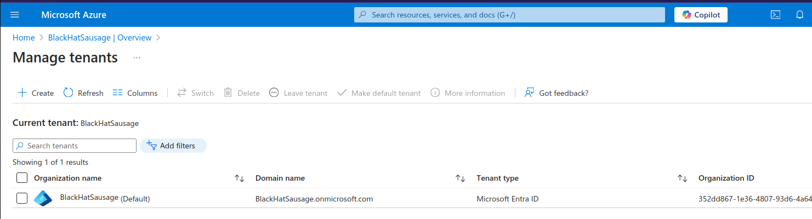
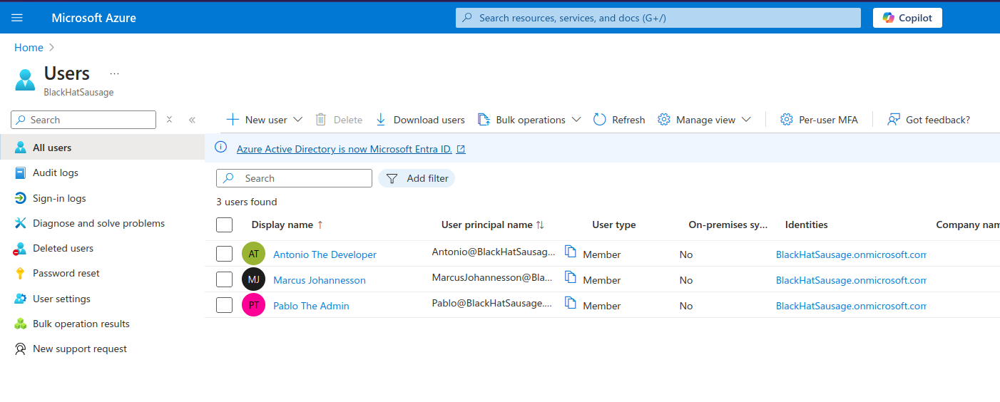
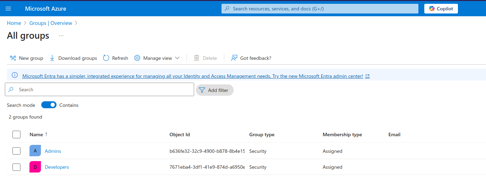
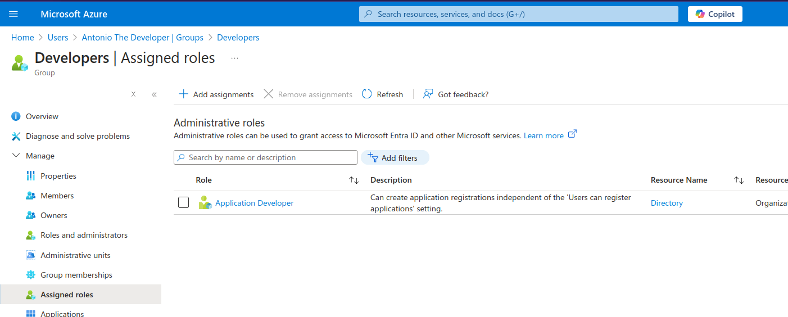
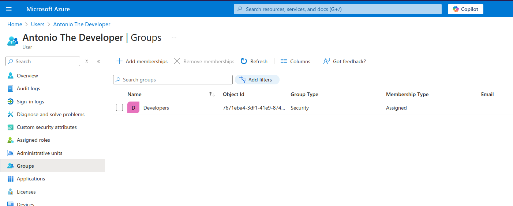
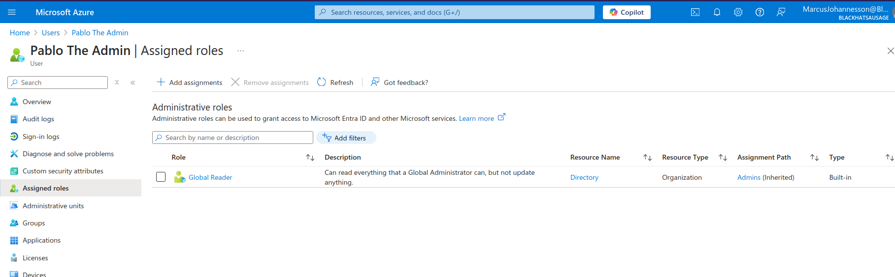

# Azure DevOps Course tasks results (Practice #1)

## Task 1

**Custom tenant created after Entra ID P2 trial activated**

**Users created **

**Admins and Devs Groups**

**Dev group role assignment**

**User added to the relevant group**

**Permissions inheritance example on second user**

