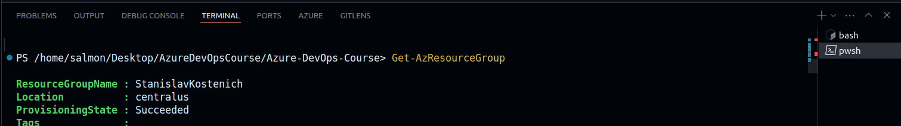
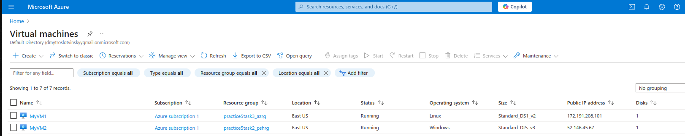
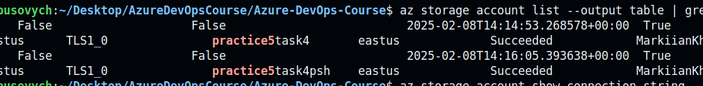
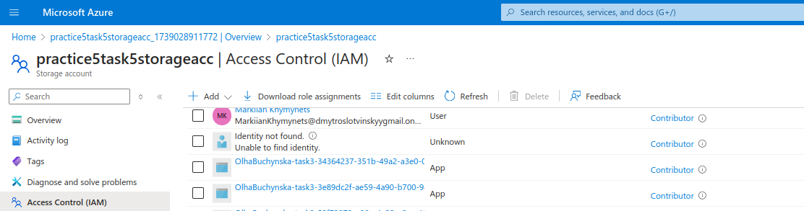
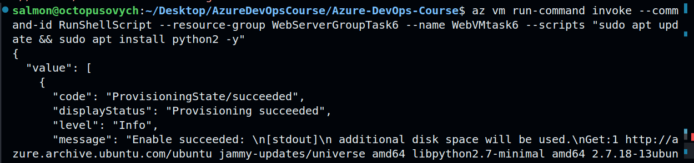
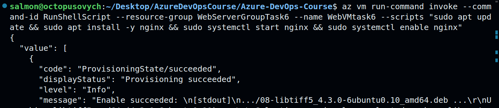
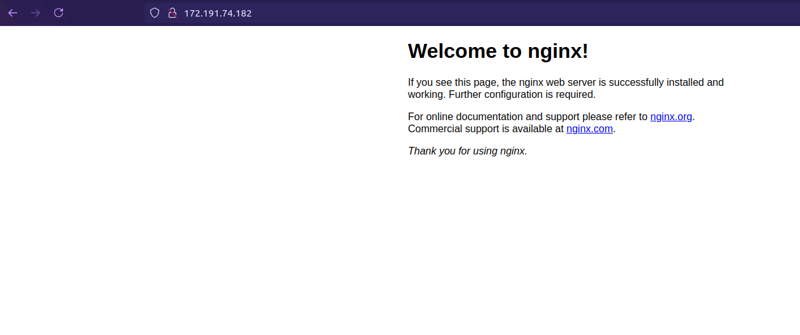
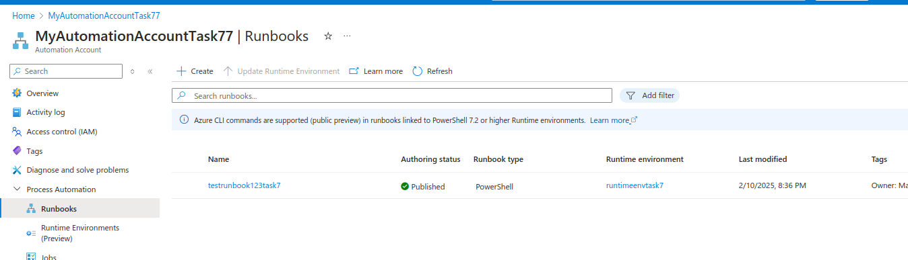

# Azure DevOps Course tasks results (Practice #5)

## Task 1
**Checking if az cli and PowerShell are installed on the host Ubuntu machine**
```bash
$ az --version
$ az login
$ az account show #json output
```
```bash
$ Get-Module -Name Az -ListAvailable
$ Connect-AzAccount
$ Get-AzSubscription
```
```bash
salmon@xxxxx:~/Desktop/xxxxx/Azure-DevOps-Course$ az account show
{
  "environmentName": "AzureCloud",
  "homeTenantId": "xxxxx-x-x-x-xxxxx",
  "id": "xxxxx-x-x-x-xxxxx",
  "isDefault": true,
  "managedByTenants": [],
  "name": "Azure subscription 1",
  "state": "Enabled",
  "tenantId": "xxxxx-x-x-x-xxxxx",
  "user": {
    "name": "Markiianxxxxx@xxxxxgmail.onmicrosoft.com",
    "type": "user"
  }
}
```

## Task 2
**Azure Resource Group creation with both az cli and Powershell**
```bash
$ az group create --name practice5task2_az --location eastus
{
  "id": "/subscriptions/xxxxx-x-x-x-xxxxx/resourceGroups/practice5task2_az",
  "location": "eastus",
  "managedBy": null,
  "name": "practice5task2_az",
  "properties": {
    "provisioningState": "Succeeded"
  },
  "tags": null,
  "type": "Microsoft.Resources/resourceGroups"
}
```
```bash
$ New-AzResourceGroup -Name practice5task2_psh -Location "East US"
ResourceGroupName : practice5task2_psh
Location          : eastus
ProvisioningState : Succeeded
Tags              : 
ResourceId        : /subscriptions/xxxxx-x-x-x-xxxxx/resourceGroups/practice5task2_psh
```
**Listing Azure Resource Groups from the CLI**
```bash
$ az group list --output table
$ Get-AzResourceGroup
```

**For convenience purposes bash and powershell terminals were created in VS Code**


**Azure Resource Groups cleaning up from the CLI**
```bash
$ az group delete --name practice5task2_az --yes --no-wait
$ Remove-AzResourceGroup -Name practice5task2_psh -Force #output: True
```

## Task 3
**Creating Azure RGs with VMs (Linux and Windows)**
```bash
$ az group create --name practice5task3_azrg --location eastus
{
  "id": "/subscriptions/xxxxx-x-x-x-xxxxx/resourceGroups/practice5task3_azrg",
  "location": "eastus",
  "managedBy": null,
  "name": "practice5task3_azrg",
  "properties": {
    "provisioningState": "Succeeded"
  },
  "tags": null,
  "type": "Microsoft.Resources/resourceGroups"
}
```
```bash
$ az vm create --resource-group practice5task3_azrg --name MyVM1 --image Ubuntu2204 --admin-username azureuser --admin-password "xxxxxx" # or --generate-ssh-keys
{
  "fqdns": "",
  "id": "/subscriptions/xxxxx-x-x-x-xxxxx/resourceGroups/practice5task3_azrg/providers/Microsoft.Compute/virtualMachines/MyVM1",
  "location": "eastus",
  "macAddress": "00-22-48-32-D2-78",
  "powerState": "VM running",
  "privateIpAddress": "10.0.0.4",
  "publicIpAddress": "172.191.208.x",
  "resourceGroup": "practice5task3_azrg",
  "zones": ""
}
```
```bash
$ New-AzResourceGroup -Name practice5task3_pshrg -Location "East US"

ResourceGroupName : practice5task3_pshrg
Location          : eastus
ProvisioningState : Succeeded
Tags              : 
ResourceId        : /subscriptions/xxxxx-x-x-x-xxxxx/resourceGroups/practice5task3_pshrg
```
```bash
$ New-AzVm -ResourceGroupName practice5task2_pshrg -Name MyVM2 -Location "eastus" -ImageName "MicrosoftWindowsServer:WindowsServer:2022-datacenter:latest" -VirtualNetworkName "MyVNet" -SubnetName "MySubnet" -SecurityGroupName "MyNSG" -PublicIpAddressName "MyPublicIP" -OpenPorts 3389 

cmdlet New-AzVM at command pipeline position 1
Supply values for the following parameters:
Credential
User: azureuser
Password for user azureuser: ****************
No Size value has been provided. The VM will be created with the default size Standard_D2s_v3.
                                                                                                                        
                                                                                                                        
ResourceGroupName        : practice5task2_pshrg                                                                         
Id                       : /subscriptions/xxxxx-x-x-x-xxxxx/resourceGroups/practice5task2_pshrg/providers/Micros
oft.Compute/virtualMachines/MyVM2                                                                                       
VmId                     : cea3d153-1c78-471b-8201-d1c8e6756411                                                         
Name                     : MyVM2                                                                                        
Type                     : Microsoft.Compute/virtualMachines                                                            
Location                 : eastus                                                                                       
Tags                     : {}                                                                                           
HardwareProfile          : {VmSize}                                                                                     
NetworkProfile           : {NetworkInterfaces}                                                                          
OSProfile                : {ComputerName, AdminUsername, WindowsConfiguration, Secrets, AllowExtensionOperations,       
RequireGuestProvisionSignal}                                                                                            
ProvisioningState        : Succeeded                                                                                    
StorageProfile           : {ImageReference, OsDisk, DataDisks}                                                          
FullyQualifiedDomainName : myvm2-81933e.eastus.cloudapp.azure.com                                                       
TimeCreated              : 2/7/2025 4:15:09 PM
```



**Retrieving VMs details using CLI**
```bash
$ az vm show --resource-group practice5task3_azrg --name MyVM1 --output table
$ Get-AzVm -ResourceGroupName practice5task3_pshrg -Name MyVM2
```

**Stopping and deleting Azure VMs**
```bash
$ az vm stop --resource-group practice5task3_azrg --name MyVM1
$ Stop-AzVm -ResourceGroupName practice5task3_pshrg -Name MyVM2 -Force
$ az vm delete --resource-group practice5task3_azrg --name MyVM1 --yes
$ Remove-AzVm -ResourceGroupName practice5task3_pshrg -Name MyVM2 -Force
```
## Task 4
**Creating Azure Storage Accounts with Azure CLI and Azure PowerShell**
```bash
$ az storage account create --name practice5task4 --resource-group Markiianxxxxx --location eastus --sku Standard_LRS
The public access to all blobs or containers in the storage account will be disallowed by default in the future, which means default value for --allow-blob-public-access is still null but will be equivalent to false.
{
  "accessTier": "Hot",
  "accountMigrationInProgress": null,
  "allowBlobPublicAccess": false,
  "allowCrossTenantReplication": false,
  "allowSharedKeyAccess": null,
  "allowedCopyScope": null,
  "azureFilesIdentityBasedAuthentication": null,
  "blobRestoreStatus": null,
  "creationTime": "2025-02-08T14:14:53.268578+00:00",
  "customDomain": null,
  "defaultToOAuthAuthentication": null,
  "dnsEndpointType": null,
  "enableHttpsTrafficOnly": true,
  "enableNfsV3": null,
  "encryption": {
    "encryptionIdentity": null,
    "keySource": "Microsoft.Storage",
    "keyVaultProperties": null,
    "requireInfrastructureEncryption": null,
    "services": {
      "blob": {
        "enabled": true,
        "keyType": "Account",
        "lastEnabledTime": "2025-02-08T14:14:53.409194+00:00"
      },
      "file": {
        "enabled": true,
        "keyType": "Account",
        "lastEnabledTime": "2025-02-08T14:14:53.409194+00:00"
      },
      "queue": null,
      "table": null
    }
  },
  "extendedLocation": null,
  "failoverInProgress": null,
  "geoReplicationStats": null,
  "id": "/subscriptions/x-x-x-x-x/resourceGroups/Markiianxxxx/providers/Microsoft.Storage/storageAccounts/practice5task4",
  "identity": null,
  "immutableStorageWithVersioning": null,
  "isHnsEnabled": null,
  "isLocalUserEnabled": null,
  "isSftpEnabled": null,
  "isSkuConversionBlocked": null,
  "keyCreationTime": {
    "key1": "2025-02-08T14:14:53.409194+00:00",
    "key2": "2025-02-08T14:14:53.409194+00:00"
  },
  "keyPolicy": null,
  "kind": "StorageV2",
  "largeFileSharesState": null,
  "lastGeoFailoverTime": null,
  "location": "eastus",
  "minimumTlsVersion": "TLS1_0",
  "name": "practice5task4",
  "networkRuleSet": {
    "bypass": "AzureServices",
    "defaultAction": "Allow",
    "ipRules": [],
    "ipv6Rules": [],
    "resourceAccessRules": null,
    "virtualNetworkRules": []
  },
  "primaryEndpoints": {
    "blob": "https://practice5task4.blob.core.windows.net/",
    "dfs": "https://practice5task4.dfs.core.windows.net/",
    "file": "https://practice5task4.file.core.windows.net/",
    "internetEndpoints": null,
    "microsoftEndpoints": null,
    "queue": "https://practice5task4.queue.core.windows.net/",
    "table": "https://practice5task4.table.core.windows.net/",
    "web": "https://practice5task4.z13.web.core.windows.net/"
  },
  "primaryLocation": "eastus",
  "privateEndpointConnections": [],
  "provisioningState": "Succeeded",
  "publicNetworkAccess": null,
  "resourceGroup": "Markiianxxxxx",
  "routingPreference": null,
  "sasPolicy": null,
  "secondaryEndpoints": null,
  "secondaryLocation": null,
  "sku": {
    "name": "Standard_LRS",
    "tier": "Standard"
  },
  "statusOfPrimary": "available",
  "statusOfSecondary": null,
  "storageAccountSkuConversionStatus": null,
  "tags": {},
  "type": "Microsoft.Storage/storageAccounts"
}
```
```bash
$ New-AzStorageAccount -ResourceGroupName "Markiianxxxxx" -Name "practice5task4psh" -Location "eastus" -SkuName "Standard_LRS" 
WARNING: Upcoming breaking changes in the cmdlet 'New-AzStorageAccount' :
Default value of AllowBlobPublicAccess will be changed from True to False in a future release. When AllowBlobPublicAccess is False on a storage account, it is not permitted to configure container ACLs to allow anonymous access to blobs within the storage account.
Cmdlet invocation changes :
    Old Way : AllowBlobPublicAccess is set to True by defult.
    New Way : AllowBlobPublicAccess is set to False by default.
Note : Go to https://aka.ms/azps-changewarnings for steps to suppress this breaking change warning, and other information on breaking changes in Azure PowerShell.

StorageAccountName ResourceGroupName PrimaryLocation SkuName      Kind      AccessTier CreationTime        ProvisioningState Enable
                                                                                                                             HttpsT
                                                                                                                             raffic
                                                                                                                             Only
------------------ ----------------- --------------- -------      ----      ---------- ------------        ----------------- ------
practice5task4psh  Markiianxxxxx eastus          Standard_LRS StorageV2 Hot        2/8/2025 2:16:05 PM Succeeded         True  
```

**Listing available Storage Accounts in the subscription**


**Retrieving connection strings from the CLI**
```bash
$ az storage account show-connection-string --name practice5task4 --resource-group Markiianxxxxx
{
  "connectionString": "DefaultEndpointsProtocol=https;EndpointSuffix=core.windows.net;AccountName=practice5task4;AccountKey=+youareanoobT2qN0VQstno0mtoFS+ZxDBKrvzTKj+xxxxx==;BlobEndpoint=https://practice5task4.blob.core.windows.net/;FileEndpoint=https://practice5task4.file.core.windows.net/;QueueEndpoint=https://practice5task4.queue.core.windows.net/;TableEndpoint=https://practice5task4.table.core.windows.net/"
}

$  (Get-AzStorageAccountKey -ResourceGroupName "Markiianxxxx" -Name "practice5task4psh")[0].Value
# output: NW0QwWkjyouareanoobthereisnotkeyisZBFe/x+AStUXyrbA==
```
**Deleting Azure Storage Accounts from the CLI**
```bash
$ az storage account delete --name practice5task4 --resource-group Markiianxxxxx --yes
$ Remove-AzStorageAccount -ResourceGroupName "Markiianxxxxx" -Name "practice5task4psh" -Force
```

## Task 5
**Note: existing user was used in this task**
**Adding an assignment using az cli and Azure PowerShell**
```bash
$ az role assignment create --assignee x-x-x-x-x --role "Reader" --scope /subscriptions/x-x-x-x-x/resourceGroups/practice5task5-rg
{
  "condition": null,
  "conditionVersion": null,
  "createdBy": null,
  "createdOn": "2025-02-08T15:30:17.041065+00:00",
  "delegatedManagedIdentityResourceId": null,
  "description": null,
  "id": "/subscriptions/xxxxx/resourceGroups/practice5task5-rg/providers/Microsoft.Authorization/roleAssignments/xxxx",
  "name": "xxxx",
  "principalId": "xxxx",
  "principalType": "User",
  "resourceGroup": "practice5task5-rg",
  "roleDefinitionId": "/subscriptions/xxxxx/providers/Microsoft.Authorization/roleDefinitions/xxxx",
  "scope": "/subscriptions/xxxxx/resourceGroups/practice5task5-rg",
  "type": "Microsoft.Authorization/roleAssignments",
  "updatedBy": "xxxxx",
  "updatedOn": "2025-02-08T15:30:17.458074+00:00"
}
```
```bash
$ $User = Get-AzADUser -UserPrincipalName "xxxxx@dmytroslotvinskyygmail.onmicrosoft.com"
$ New-AzRoleAssignment -ObjectId $User.Id -RoleDefinitionName "Contributor" -Scope "/subscriptions/xxxxx/resourceGroups/practice5task5-rg/providers/Microsoft.Storage/storageAccounts/practice5task5storageacc"
```

**Reviewing IAM section at the newly created Azure Storage Account and assignment added (Contributor built-in role)**


**Listing assignments using az cli and Azure PowerShell**
```bash
$ az role assignment list --assignee xxxxxx@dmytroslotvinskyygmail.onmicrosoft.com --output table
$ Get-AzRoleAssignment -SignInName "xxxxx@dmytroslotvinskyygmail.onmicrosoft.com"
```

**Clean Up: deleting previously created assignments**
```bash
az role assignment delete --assignee xxxxx@dmytroslotvinskyygmail.onmicrosoft.com --role "Reader" --resource-group practice5task5-rg

$ User = Get-AzADUser -UserPrincipalName "xxxxx@dmytroslotvinskyygmail.onmicrosoft.com"
$ Remove-AzRoleAssignment -ObjectId $User.Id -RoleDefinitionName "Contributor" -Scope "/subscriptions/xxxx-x-x-x-xxxxx/resourceGroups/practice5task5-rg/providers/Microsoft.Storage/storageAccounts/practice5task5storageacc"
#Ouput: 
Succesfully removed role assignment for AD object 'xxxx-x-x-x-xxxx' on scope '/subscriptions/xxxxx-x-x-x-xxxx/resourceGroups/practice5task5-rg/providers/Microsoft.Storage/storageAccounts/practice5task5storageacc' with role definition 'Contributor'
```

## Task 6
**Azure Resource Group created using Azure CLI on local Ubuntu machine**
```bash
$ az group create --name WebServerGroupTask6 --location eastus
```

**Deploying a Virtual Network and Subnet**
```bash
$ az network vnet create --resource-group WebServerGroupTask6 --name WebVNet --address-prefix 10.0.0.0/16 --subnet-name WebSubnet --subnet-prefix 10.0.0.0/24
```

**Creating Storage Account for Logs**
```bash
$ New-AzStorageAccount -ResourceGroupName WebServerGroupTask6 -Name webserverlogsatask6 -Location eastus -SkuName Standard_LRS -Kind StorageV2
```

**Enabling Blob Storage and creating a container**
```bash
$storageAccount = Get-AzStorageAccount -ResourceGroupName WebServerGroupTask6 -Name webserverlogsatask6
$ctx = $storageAccount.Context
New-AzStorageContainer -Name logs -Context $ctx -Permission Blob
```

**Azure VM deployment**
```bash
$ az vm create --resource-group WebServerGroupTask6 --name WebVMtask6 --image Ubuntu2204 --admin-username azureuser --admin-username "xxxxx" --size Standard_B1s --vnet-name WebVNet --subnet WebSubnet --public-ip-address WebVM-IP
```
```bash
$ az vm open-port --port 80 --resource-group WebServerGroupTask6 --name WebVMtask6
```

**Installing python2 as a prerequisite for Linux Diagnostics later on**


**Nginx configuration**
```bash
az vm run-command invoke --command-id RunShellScript --resource-group WebServerGroupTask6 --name WebVMtask6 --scripts "sudo apt update && sudo apt install -y nginx && sudo systemctl start nginx && sudo systemctl enable nginx"
```




**Azure Linux diagnostics enabled**
```bash
$storageAccount = Get-AzStorageAccount -ResourceGroupName WebServerGroupTask6 -Name webserverlogsatask6
$storageKey = (Get-AzStorageAccountKey -ResourceGroupName WebServerGroupTask6 -Name $storageAccount.StorageAccountName)[0].Value

$ az vm diagnostics set \
  --resource-group WebServerGroupTask6 \
  --vm-name WebVMtask6 \
  --settings '{"ladCfg": {"diagnosticMonitorConfiguration": {"performanceCounters": {"performanceCounterConfiguration": [{"counterSpecifier": "/proc/stat", "sampleRateInSeconds": 10}, {"counterSpecifier": "/proc/meminfo", "sampleRateInSeconds": 10}, {"counterSpecifier": "/proc/diskstats", "sampleRateInSeconds": 10}]}}}}' \
  --protected-settings "{\"storageAccount\": \"$storageAccount.StorageAccountName\", \"storageAccountKey\": \"$storageKey\"}"
```

**Cleaning resources up**
```bash
$ az group delete --name WebServerGroupTask6 --yes --no-wait
```

## Task 7
**Creating Azure Automation Account using Azure CLI**
```bash
$ az automation account create --name MyAutomationAccountTask77 --resource-group Markiianxxxxx --location eastus
```

**Creating automation runbook from the CLI**
```bash
az automation runbook create --automation-account-name MyAutomationAccountTask77 --name testrunbook123task7 --resource-group Markiianxxxxx --type PowerShell
```

```bash
NOTE! Runbook creation bug is currently in process of resolving by MS Azure team
Reference: https://learn.microsoft.com/en-us/answers/questions/1514806/azure-cloud-creating-automation-account-bad-reques
```



**PowerShell script used for a runbook**
```bash
param (
    [string]$ResourceGroupName,
    [string]$VMName
)

# Authenticate with Managed Identity (if available) or use Azure Automation credentials
$connection = Get-AutomationConnection -Name "AzureRunAsConnection"
Connect-AzAccount -ServicePrincipal -TenantId $connection.TenantId -ApplicationId $connection.ApplicationId -CertificateThumbprint $connection.CertificateThumbprint

# Start the Azure VM
Start-AzVM -ResourceGroupName $ResourceGroupName -Name $VMName -NoWait
Write-Output "VM $VMName in Resource Group $ResourceGroupName is starting."
```
**Runbook schedule applied**
```bash
$ az automation schedule create --automation-account-name MyAutomationAccountTask77 --resource-group xxxxx --name DailyStartSchedule --start-time "2025
-02-11T06:00:00Z" --description "Daily VM Start" --frequency Day --interval 1
{
  "advancedSchedule": null,
  "creationTime": "2025-02-10T18:40:43.296666+00:00",
  "description": "Daily VM Start",
  "expiryTime": "9999-12-31T23:59:00+00:00",
  "expiryTimeOffsetMinutes": 0.0,
  "frequency": "Day",
  "id": "/subscriptions/xxxxx/resourceGroups/xxxxx/providers/Microsoft.Automation/automationAccounts/MyAutomationAccountTask77/schedules/DailyStartSchedule",
  "interval": 1,
  "isEnabled": true,
  "lastModifiedTime": "2025-02-10T18:40:43.296666+00:00",
  "name": "DailyStartSchedule",
  "nextRun": "2025-02-11T06:00:00+00:00",
  "nextRunOffsetMinutes": 0.0,
  "resourceGroup": "Markiianxxxxx",
  "startTime": "2025-02-11T06:00:00+00:00",
  "startTimeOffsetMinutes": 0.0,
  "timeZone": "Etc/UTC",
  "type": "Microsoft.Automation/AutomationAccounts/Schedules"
}
```
**Runbook published/started from the CLI**
```bash
$ az automation runbook start --automation-account-name MyAutomationAccountTask77 --name testrunbook123task7 --resource-group xxxxx --parameters ResourceGroupName="VMResourceGroup" VMName="MyVM1"
Command group 'automation runbook' is experimental and under development. Reference and support levels: https://aka.ms/CLI_refstatus
{
  "creationTime": "2025-02-10T18:38:56.366666+00:00",
  "endTime": null,
  "exception": null,
  "id": "/subscriptions/xxxxx/resourceGroups/xxxxx/providers/Microsoft.Automation/automationAccounts/MyAutomationAccountTask77/jobs/d944c104-92a9-46ba-93c4-a7cd966a26e7",
  "jobId": "7dc0ceac-3b88-4db5-ad1b-a4baf97bad3b",
  "lastModifiedTime": "2025-02-10T18:38:56.366666+00:00",
  "lastStatusModifiedTime": "2025-02-10T18:38:56.366666+00:00",
  "name": "d944c104-92a9-46ba-93c4-a7cd966a26e7",
  "parameters": {
    "ResourceGroupName": "VMResourceGroup",
    "VMName": "MyVM1"
  },
  "provisioningState": "Processing",
  "resourceGroup": "xxxxx",
  "runOn": null,
  "runbook": {
    "name": "testrunbook123task7"
  },
  "startTime": null,
  "startedBy": null,
  "status": "New",
  "statusDetails": "None",
  "type": "Microsoft.Automation/AutomationAccounts/Jobs"
}
```

**Listing jobs**
```bash
$ az automation job list --automation-account-name "MyAutomationAccountTask77" --resource-group "xxxxx"
Command group 'automation job' is experimental and under development. Reference and support levels: https://aka.ms/CLI_refstatus
[
  {
    "creationTime": "2025-02-10T18:38:56.375939+00:00",
    "endTime": "2025-02-10T18:40:01.335658+00:00",
    "id": "/subscriptions/xxxxxx/resourceGroups/xxxxx/providers/Microsoft.Automation/automationAccounts/MyAutomationAccountTask77/jobs/x-x-x-x-x",
    "jobId": "7dc0ceac-3b88-4db5-ad1b-a4baf97bad3b",
    "lastModifiedTime": "2025-02-10T18:40:01.335658+00:00",
    "name": "d944c104-92a9-46ba-93c4-a7cd966a26e7",
    "provisioningState": "Succeeded",
    "resourceGroup": "xxxxx",
    "runOn": null,
    "runbook": {
      "name": "testrunbook123task7"
    },
    "startTime": "2025-02-10T18:39:46.901627+00:00",
    "status": "Completed",
    "type": "Microsoft.Automation/AutomationAccounts/Jobs"
  }
]
```

## Task 8