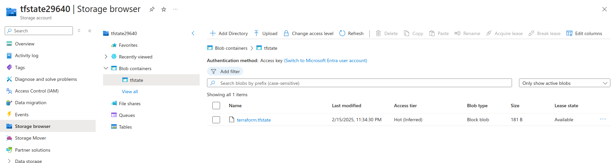
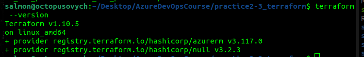
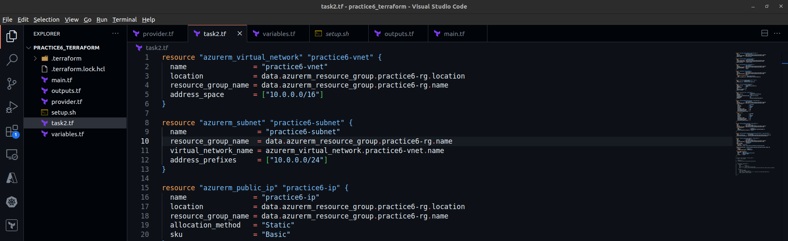
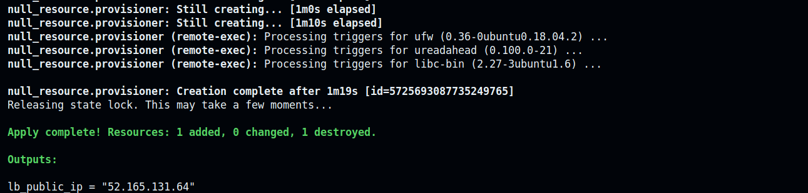
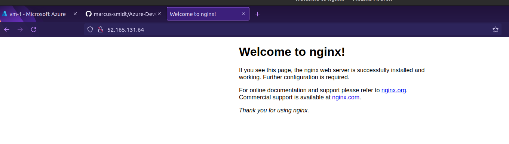
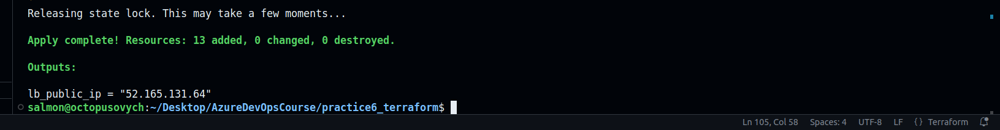
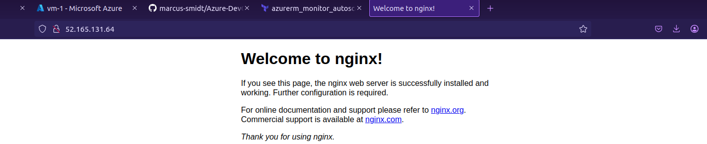
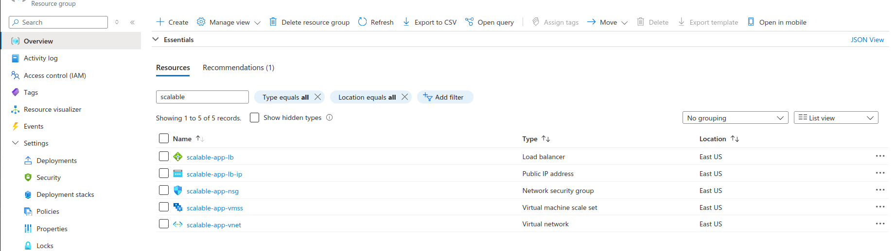

# Azure DevOps Course tasks results (Practice #6)

## Task 1
**Terraform folder and files structure aligned; dependencies installed and Azure connected**
**Setup script taken from MS Learn stuff**
```bash
#!/bin/bash

RESOURCE_GROUP_NAME=Markiianxxxxx
STORAGE_ACCOUNT_NAME=tfstate$RANDOM
CONTAINER_NAME=tfstate

# Create resource group
az group create --name $RESOURCE_GROUP_NAME --location eastus

# Create storage account
az storage account create --resource-group $RESOURCE_GROUP_NAME --name $STORAGE_ACCOUNT_NAME --sku Standard_LRS --encryption-services blob

# Create blob container
az storage container create --name $CONTAINER_NAME --account-name $STORAGE_ACCOUNT_NAME
```



## Task 2
**Terraform code for deploying resources specified in task description**
```bash
resource "azurerm_virtual_network" "practice6-vnet" {
  name                = "practice6-vnet"
  address_space       = ["10.0.0.0/16"]
  location            = data.azurerm_resource_group.practice6-rg.location
  resource_group_name = data.azurerm_resource_group.practice6-rg.name
}

resource "azurerm_subnet" "practice6-subnet" {
  name                 = "practice6-subnet"
  resource_group_name  = data.azurerm_resource_group.practice6-rg.name
  virtual_network_name = azurerm_virtual_network.practice6-vnet.name
  address_prefixes     = ["10.0.1.0/24"]
}

resource "azurerm_network_security_group" "practice6-nsg" {
  name                = "practice6-nsg"
  location            = data.azurerm_resource_group.practice6-rg.location
  resource_group_name = data.azurerm_resource_group.practice6-rg.name

  security_rule {
    name                       = "Allow-SSH"
    priority                   = 1001
    direction                  = "Inbound"
    access                     = "Allow"
    protocol                   = "Tcp"
    source_port_range          = "*"
    destination_port_range     = "22"
    source_address_prefix      = "*"
    destination_address_prefix = "*"
  }

  security_rule {
    name                       = "Allow-HTTP"
    priority                   = 1002
    direction                  = "Inbound"
    access                     = "Allow"
    protocol                   = "Tcp"
    source_port_range          = "*"
    destination_port_range     = "80"
    source_address_prefix      = "*"
    destination_address_prefix = "*"
  }
}

resource "azurerm_network_interface" "practice6-nic" {
  name                = "practice6-nic"
  location            = data.azurerm_resource_group.practice6-rg.location
  resource_group_name = data.azurerm_resource_group.practice6-rg.name

  ip_configuration {
    name                          = "internal"
    subnet_id                     = azurerm_subnet.practice6-subnet.id
    private_ip_address_allocation = "Dynamic"
    public_ip_address_id          = azurerm_public_ip.practice6-ip.id
  }
}

resource "azurerm_public_ip" "practice6-ip" {
  name                = "practice6-ip"
  location            = data.azurerm_resource_group.practice6-rg.location
  resource_group_name = data.azurerm_resource_group.practice6-rg.name
  allocation_method   = "Static"
  sku                 = "Basic"
}

resource "azurerm_network_interface_security_group_association" "practice6-association" {
  network_interface_id      = azurerm_network_interface.practice6-nic.id
  network_security_group_id = azurerm_network_security_group.practice6-nsg.id
}

resource "azurerm_linux_virtual_machine" "practice6-vm" {
  name                  = "practice6-vm"
  resource_group_name   = data.azurerm_resource_group.practice6-rg.name
  location              = data.azurerm_resource_group.practice6-rg.location
  size                  = "Standard_B1s"
  admin_username        = "azureuser"
  network_interface_ids = [azurerm_network_interface.practice6-nic.id]
  admin_ssh_key {
    username   = "azureuser"
    public_key = file("../practice2-3_terraform/id_rsa_practice2.pub")
  }

  os_disk {
    caching              = "ReadWrite"
    storage_account_type = "Standard_LRS"
    disk_size_gb         = 30
  }

  source_image_reference {
    publisher = "Canonical"
    offer     = "UbuntuServer"
    sku       = "18.04-LTS"
    version   = "latest"
  }
}

resource "null_resource" "provisioner" {
  depends_on = [azurerm_linux_virtual_machine.practice6-vm]

  provisioner "remote-exec" {
    inline = [
      "sudo apt update -y",
      "sudo apt install nginx -y"
    ]

    connection {
      type        = "ssh"
      user        = "azureuser"
      private_key = file("../practice2-3_terraform/id_rsa_practice2")
      host        = azurerm_public_ip.practice6-ip.ip_address
    }
  }
}
```

**Terraform files structure in VS Code**


**terraform apply command output and nginx website browsing**



## Task 3
**Terraform files incl. modules (compute, networking, security), variables and main file**
```bash
#compute module main.tf
data "azurerm_resource_group" "practice6-rg" {
  name = "MarkiianKhymynets"
}

resource "azurerm_public_ip" "lb" {
  name                = "${var.prefix}-lb-ip"
  location           = var.location
  resource_group_name = data.azurerm_resource_group.practice6-rg.name
  allocation_method   = "Static"
  sku                = "Standard"
}

resource "azurerm_lb" "main" {
  name                = "${var.prefix}-lb"
  location           = var.location
  resource_group_name = data.azurerm_resource_group.practice6-rg.name
  sku                = "Standard"

  frontend_ip_configuration {
    name                 = "frontend-ip"
    public_ip_address_id = azurerm_public_ip.lb.id
  }
}

resource "azurerm_lb_backend_address_pool" "main" {
  name            = "backend-pool"
  loadbalancer_id = azurerm_lb.main.id
}

resource "azurerm_lb_probe" "main" {
  name            = "http-probe"
  loadbalancer_id = azurerm_lb.main.id
  protocol        = "Http"
  port            = 80
  request_path    = "/"
}

resource "azurerm_lb_rule" "main" {
  name                           = "http-rule"
  loadbalancer_id               = azurerm_lb.main.id
  protocol                      = "Tcp"
  frontend_port                 = 80
  backend_port                  = 80
  frontend_ip_configuration_name = "frontend-ip"
  backend_address_pool_ids      = [azurerm_lb_backend_address_pool.main.id]
  probe_id                      = azurerm_lb_probe.main.id
}

resource "azurerm_virtual_machine_scale_set" "main" {
  name                = "${var.prefix}-vmss"
  location           = var.location
  resource_group_name = data.azurerm_resource_group.practice6-rg.name
  upgrade_policy_mode = "Manual"

  sku {
    name     = "Standard_DS1_v2"
    tier     = "Standard"
    capacity = 2
  }

  storage_profile_image_reference {
    publisher = "Canonical"
    offer     = "UbuntuServer"
    sku       = "18.04-LTS"
    version   = "latest"
  }

  storage_profile_os_disk {
    name              = ""
    caching           = "ReadWrite"
    create_option     = "FromImage"
    managed_disk_type = "Standard_LRS"
  }

  os_profile {
    computer_name_prefix = "vmss"
    admin_username      = "azureuser"
    admin_password      = "Password1234!"
    custom_data         = base64encode(<<-EOF
      #!/bin/bash
      apt-get update
      apt-get install -y apache2
      echo "Hello from VMSS Instance!" > /var/www/html/index.html
      EOF
    )
  }

  network_profile {
    name    = "networkprofile"
    primary = true

    ip_configuration {
      name                                   = "internal"
      subnet_id                             = var.subnet_id
      load_balancer_backend_address_pool_ids = [azurerm_lb_backend_address_pool.main.id]
      primary                               = true
    }
  }
}

resource "azurerm_monitor_autoscale_setting" "main" {
  name                = "autoscale-config"
  resource_group_name = data.azurerm_resource_group.practice6-rg.name
  location            = data.azurerm_resource_group.practice6-rg.location
  target_resource_id  = azurerm_virtual_machine_scale_set.main.id

  profile {
    name = "AutoScale"

    capacity {
      default = 2
      minimum = 2
      maximum = 10
    }

    rule {
        metric_trigger {
          metric_name        = "Percentage CPU"
          metric_resource_id = azurerm_virtual_machine_scale_set.main.id
          time_grain        = "PT1M"
          statistic         = "Average"
          time_window       = "PT5M"
          time_aggregation  = "Average"
          operator         = "GreaterThan"
          threshold        = 75
        }
        scale_action {
          direction = "Increase"
          type      = "ChangeCount"
          value     = "1"
          cooldown  = "PT1M"
        }
      }
      rule {
        metric_trigger {
          metric_name        = "Percentage CPU"
          metric_resource_id = azurerm_virtual_machine_scale_set.main.id
          time_grain        = "PT1M"
          statistic         = "Average"
          time_window       = "PT5M"
          time_aggregation  = "Average"
          operator         = "LessThan"
          threshold        = 25
        }
        scale_action {
          direction = "Decrease"
          type      = "ChangeCount"
          value     = "1"
          cooldown  = "PT1M"
        }
      }
    }
}

#networking module main.tf
data "azurerm_resource_group" "practice6-rg" {
  name = "MarkiianKhymynets"
}

resource "azurerm_virtual_network" "main" {
  name                = "${var.prefix}-vnet"
  address_space       = var.address_space
  location           = var.location
  resource_group_name = var.resource_group_name
}

resource "azurerm_subnet" "subnet1" {
  name                 = "${var.prefix}-subnet-1"
  resource_group_name  = var.resource_group_name
  virtual_network_name = azurerm_virtual_network.main.name
  address_prefixes     = [cidrsubnet(var.address_space[0], 8, 1)]
}

resource "azurerm_subnet" "subnet2" {
  name                 = "${var.prefix}-subnet-2"
  resource_group_name  = var.resource_group_name
  virtual_network_name = azurerm_virtual_network.main.name
  address_prefixes     = [cidrsubnet(var.address_space[0], 8, 2)]
}

#security module main.tf
data "azurerm_resource_group" "practice6-rg" {
  name = "MarkiianKhymynets"
}

resource "azurerm_network_security_group" "main" {
  name                = "${var.prefix}-nsg"
  location           = var.location
  resource_group_name = var.resource_group_name

  security_rule {
    name                       = "HTTP"
    priority                   = 100
    direction                  = "Inbound"
    access                     = "Allow"
    protocol                   = "Tcp"
    source_port_range          = "*"
    destination_port_range     = "80"
    source_address_prefix      = "*"
    destination_address_prefix = "*"
  }
}

# Associate NSG with subnet
resource "azurerm_subnet_network_security_group_association" "main" {
  subnet_id                 = var.subnet_id
  network_security_group_id = azurerm_network_security_group.main.id
}

#task3.tf file
resource "random_string" "storage_account_suffix" {
  length  = 8
  special = false
  upper   = false
}

# Networking Module
module "networking" {
  source              = "./modules/networking"
  resource_group_name = data.azurerm_resource_group.practice6-rg.name
  location            = var.location
  prefix              = var.prefix
  address_space       = ["10.0.0.0/16"]
}

# Security Module
module "security" {
  source              = "./modules/security"
  resource_group_name = data.azurerm_resource_group.practice6-rg.name
  location           = var.location
  prefix             = var.prefix
  subnet_id          = module.networking.subnet_id  # Add this line
}

# Compute Module (VMSS and Load Balancer)
module "compute" {
  source              = "./modules/compute"
  resource_group_name = data.azurerm_resource_group.practice6-rg.name
  location            = var.location
  prefix              = var.prefix
  subnet_id           = module.networking.subnet_id
  nsg_id              = module.security.nsg_id
}
```




## Task 4


