# Azure DevOps Course tasks results (Practice #7)

## Task 1
**Ubuntu 22.04 VM was created to be added a self-hosted agent**
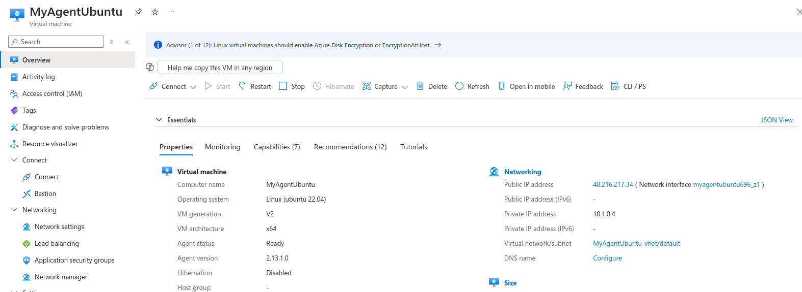


**Agent configured**
```bash
$ mkdir myagent && cd myagent
$ wget -O ~/myagent/vsts-agent.tar.gz https://vstsagentpackage.azureedge.net/agent/4.251.0/vsts-agent-linux-x64-4.251.0.tar.gz
$ tar zxvf ~/myagent/vsts-agent.tar.gz
$ ./config.sh
      - url org : https://dev.azure.com/AzureDevOpsCoursexxx
      -PAT : ******
      -Agent Pool: MyLinux
      -Agent Name: myAgent
      - skip 
$ /run.sh
```
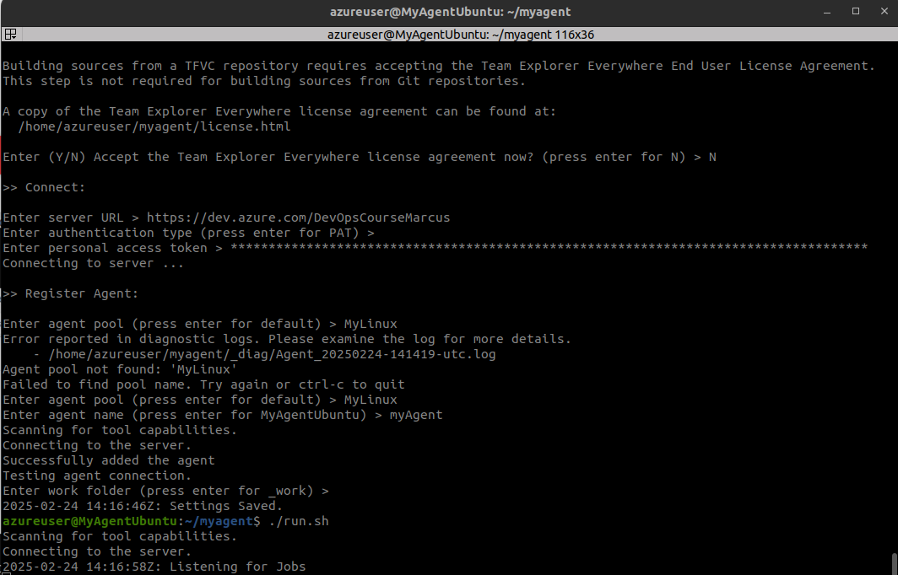

**Note: Repository created by Dmytro, ssh key authorization added (ssh-rsa)**


## Task 2
**Git commands used in the task**
```bash
$ git checkout -b feature-enhancement
$ touch FEATURES.md

# Potential Features
## Feature 1
**GitOps approach implementation**
## Feature 2
**Automatic clean up on Friday**
$ sudo rm -rf *
## Feature 3
**Lorem ipsum**

$ git add .
$ git commit -m "Ticket#12345 Features planning"
$ git push --set-upstream origin feature-enhancement
```

**PR created, reviewer added**
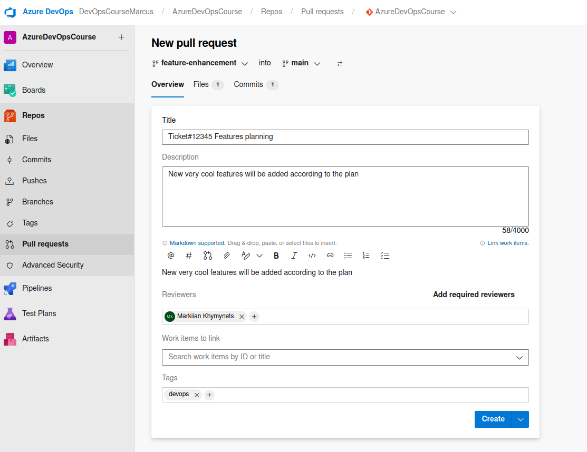
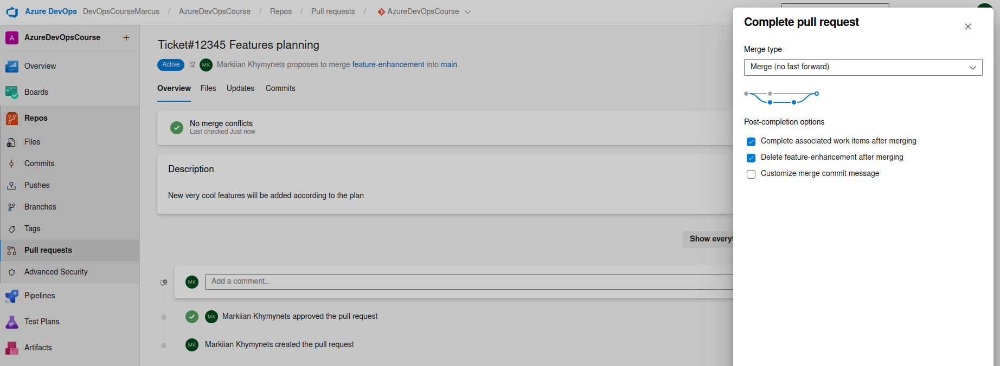

## Task 3
**Minimal number of reviewer added to ADO Repos main branch**
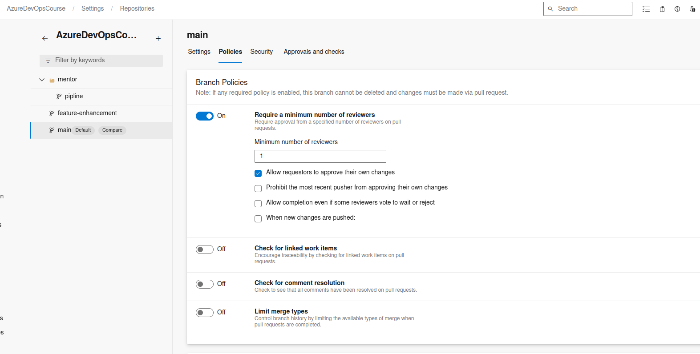

**Mandatory reviewer (admin) added to the main branch**
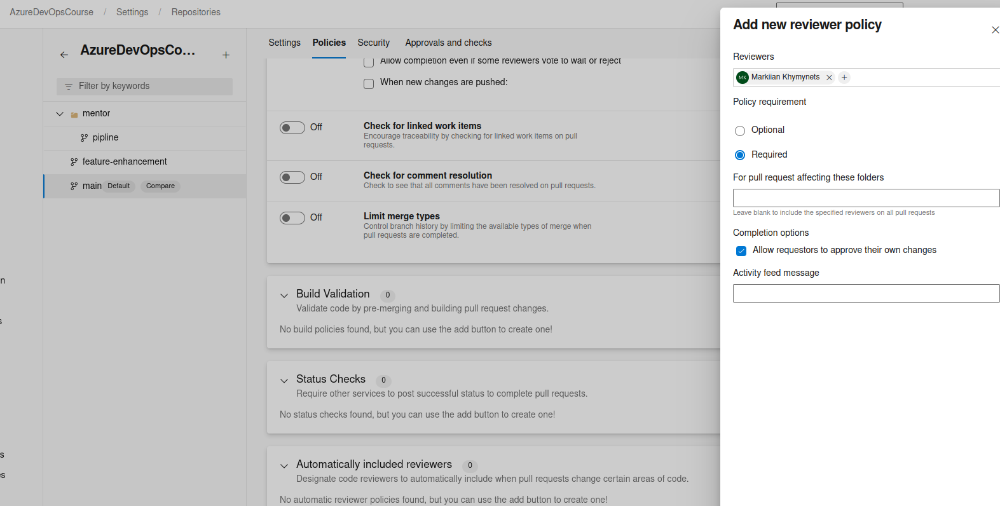

**Build policy in place as well (validating code by pre-merging and building pull request changes)**
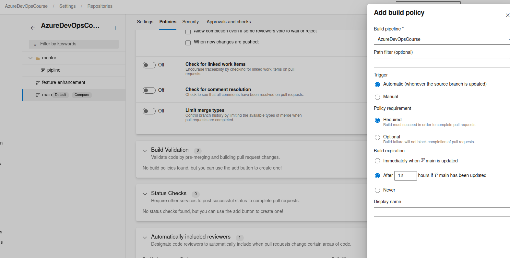

**Branch policies in action (PR initiated and actions automatically performed)**
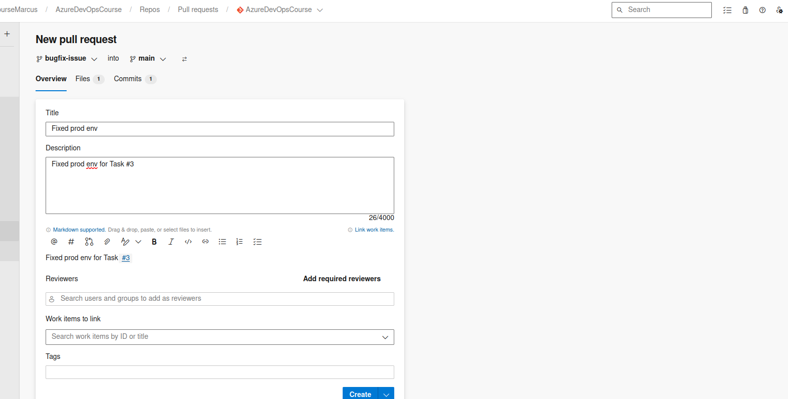

## Task 4
**New repo MySampleApp was created; showing code sample**
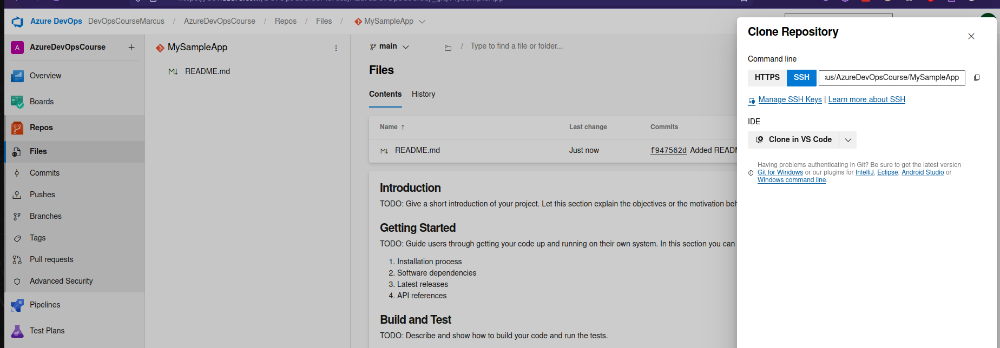
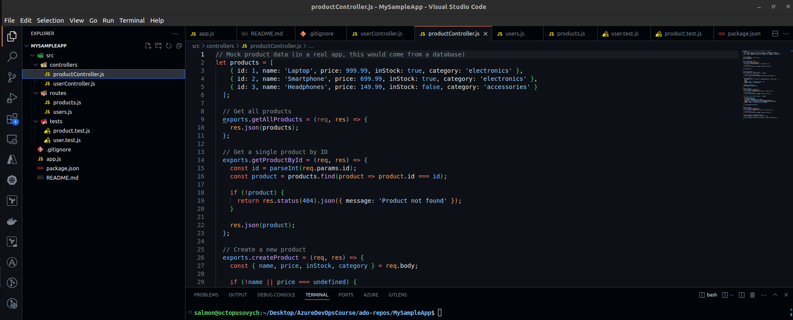

**Azure DevOps Pipeline YAML code**
```bash
trigger:
- main

pool:
  name: MyLinux
  demands:
    - agent.name -equals myAgent

steps:
- task: NodeTool@0
  inputs:
    versionSpec: '18.x'
  displayName: 'Install Node.js'

- script: |
    npm install
  displayName: 'Install dependencies'

- script: |
    npm run build
  displayName: 'Build application'

- script: |
    npm test
  displayName: 'Run tests'

# Use a different approach for creating the artifact
- script: |
    npm install archiver --no-save
    node -e "
    const fs = require('fs');
    const path = require('path');
    const archiver = require('archiver');
    
    // Create a file to stream archive data to
    const output = fs.createWriteStream('$(Build.ArtifactStagingDirectory)/$(Build.BuildId).zip');
    const archive = archiver('zip', { zlib: { level: 9 } });
    
    output.on('close', () => {
      console.log('Archive created successfully');
    });
    
    archive.on('error', (err) => {
      throw err;
    });
    
    archive.pipe(output);
    
    // Add the files
    archive.directory('dist/', false);
    archive.file('package.json', { name: 'package.json' });
    
    archive.finalize();
    "
  displayName: 'Create archive'
    
- task: PublishBuildArtifacts@1
  inputs:
    PathtoPublish: '$(Build.ArtifactStagingDirectory)'
    ArtifactName: 'drop'
    publishLocation: 'Container'
```

**Running the pipeline and reviewing the bild details**
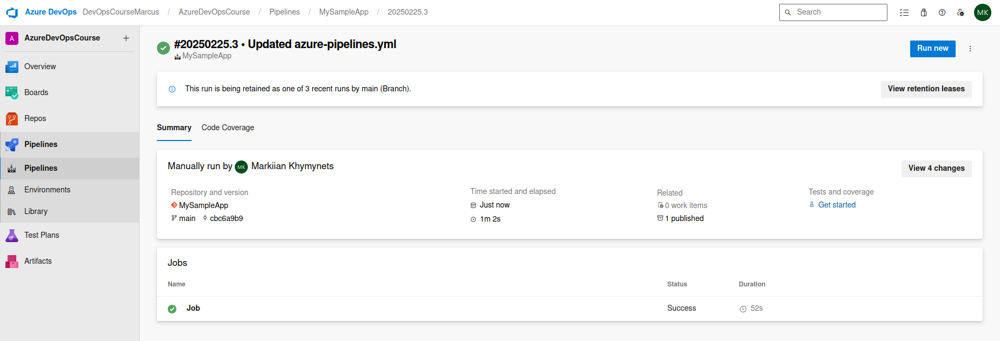
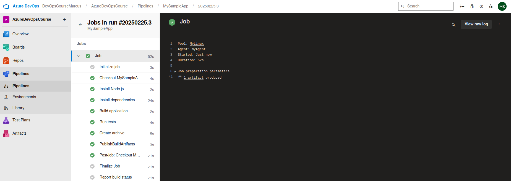

## Task 5
**Azure DevOps YAML file**
```bash
# Azure DevOps Pipeline for Node.js Application with Azure Web App Deployment
trigger:
- main

# Define variables for reuse
variables:
  # Build configuration
  buildConfiguration: 'Release'
  # Azure Web App name - replace with your actual web app name
  webAppName: 'MySampleNodeApp'
  # Azure service connection name - replace with your actual service connection
  azureSubscription: 'task5connection'
  # Node.js version
  nodeVersion: '18.x'

# Define the stages of the pipeline
stages:
- stage: Build
  displayName: 'Build Stage'
  jobs:
  - job: BuildJob
    displayName: 'Build Node.js App'
    pool:
     name: MyLinux
     demands:
     - agent.name -equals myAgent
    
    steps:
    # Set up Node.js environment
    - task: NodeTool@0
      inputs:
        versionSpec: '$(nodeVersion)'
      displayName: 'Install Node.js'
    
    # Install dependencies
    - script: |
        npm install
      displayName: 'Install dependencies'
    
    # Run build script
    - script: |
        npm run build
      displayName: 'Build application'
    
    # Run tests
    - script: |
        npm test
      displayName: 'Run tests'
    
    # Archive files for deployment
    - task: CopyFiles@2
      inputs:
        SourceFolder: '$(System.DefaultWorkingDirectory)'
        Contents: |
          dist/**
          node_modules/**
          package.json
          web.config
        TargetFolder: '$(Build.ArtifactStagingDirectory)'
      displayName: 'Copy files for artifact'
    
    # Create web.config for Azure Web App (if it doesn't exist)
    - script: |
        if [ ! -f "$(Build.ArtifactStagingDirectory)/web.config" ]; then
          echo '<?xml version="1.0" encoding="utf-8"?>
          <configuration>
            <system.webServer>
              <handlers>
                <add name="iisnode" path="app.js" verb="*" modules="iisnode" />
              </handlers>
              <rewrite>
                <rules>
                  <rule name="myapp">
                    <match url="/*" />
                    <action type="Rewrite" url="app.js" />
                  </rule>
                </rules>
              </rewrite>
              <iisnode watchedFiles="web.config;*.js" />
            </system.webServer>
          </configuration>' > $(Build.ArtifactStagingDirectory)/web.config
        fi
      displayName: 'Create web.config if not exists'
    
    # Publish build artifacts
    - task: PublishBuildArtifacts@1
      inputs:
        PathtoPublish: '$(Build.ArtifactStagingDirectory)'
        ArtifactName: 'drop'
        publishLocation: 'Container'
      displayName: 'Publish artifacts'

- stage: Deploy
  displayName: 'Deploy Stage'
  dependsOn: Build
  condition: succeeded()
  jobs:
  - deployment: DeployJob
    displayName: 'Deploy to Azure Web App'
    environment: 'Production'  # You can create environments in Azure DevOps
    pool:
     name: MyLinux
     demands:
     - agent.name -equals myAgent
    strategy:
      runOnce:
        deploy:
          steps:
          # Deploy to Azure Web App
          - task: AzureWebApp@1
            displayName: 'Deploy Azure Web App'
            inputs:
              azureSubscription: 'task5connection'
              appType: 'webApp'
              appName: 'task5webapp'
              package: '$(Pipeline.Workspace)/drop'
              deploymentMethod: 'auto'
              # Set startup command if needed (uncomment if required)
              # appSettings: 'npm start'
```

**Pipeline stages and running process**
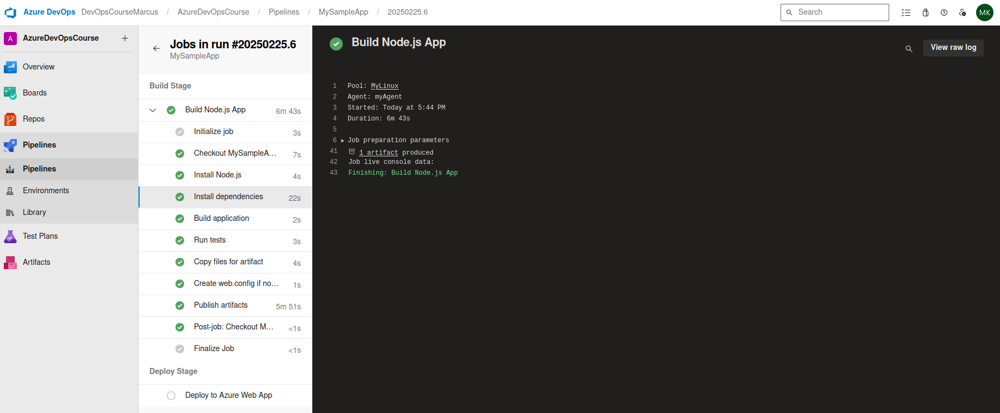
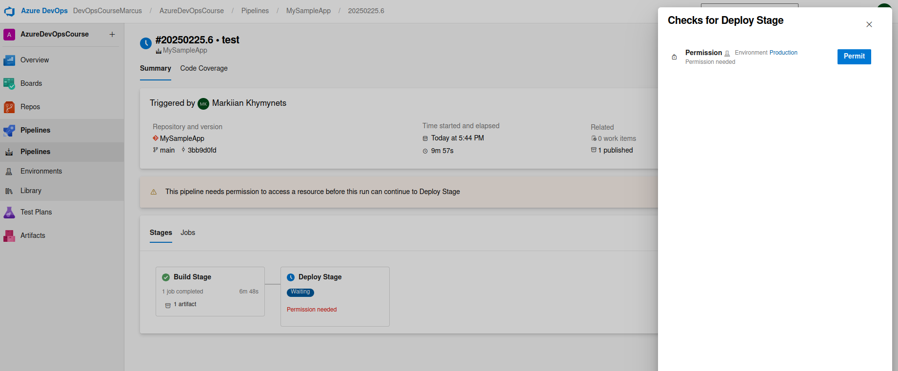
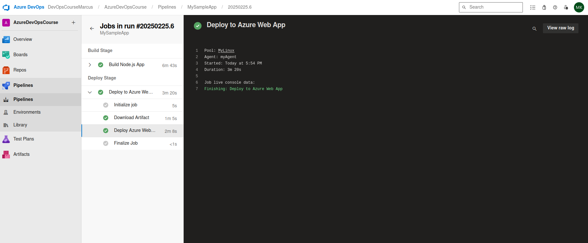
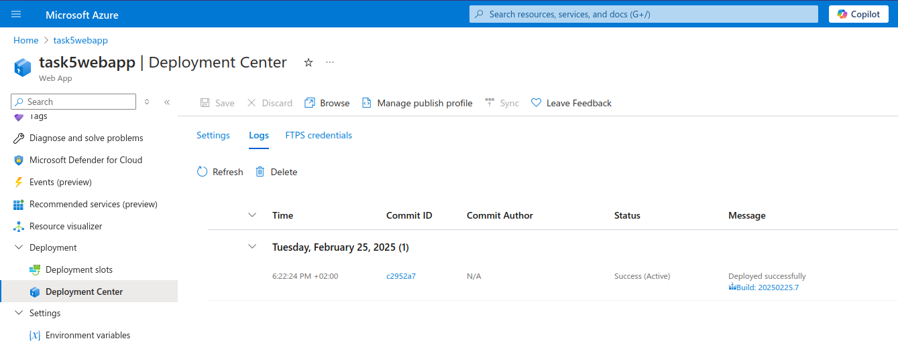
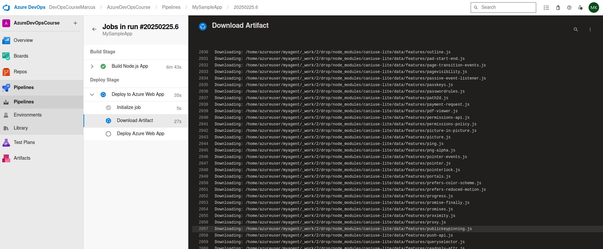
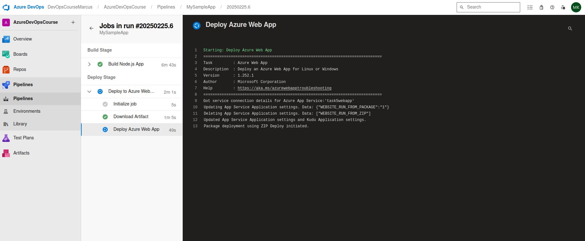

**Verifying the Node.js app is running**
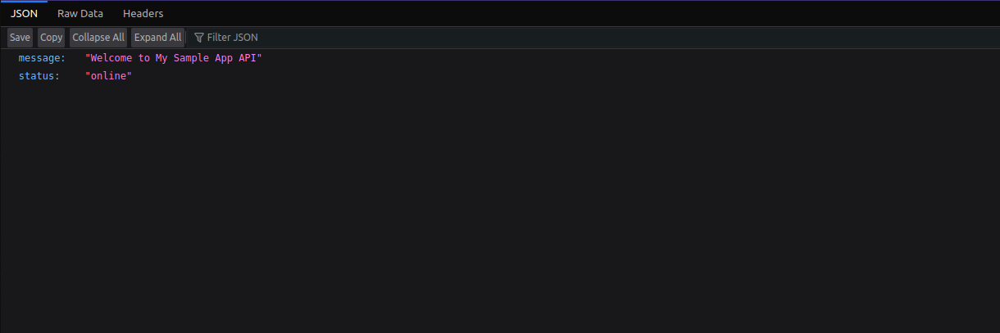

## Task 8
**Bicep template file for creating Azure Storage Account**
```bash
@description('Name of the Storage Account')
param storageAccountName string

@description('Location for the Storage Account')
param location string = resourceGroup().location

@description('Number of days to retain deleted blobs')
@minValue(1)
@maxValue(365)
param softDeleteRetentionDays int = 7

resource storageAccount 'Microsoft.Storage/storageAccounts@2021-09-01' = {
  name: storageAccountName
  location: location
  sku: {
    name: 'Standard_LRS'
  }
  kind: 'StorageV2'
  properties: {
    minimumTlsVersion: 'TLS1_2'
    allowBlobPublicAccess: false
    publicNetworkAccess: 'Enabled'
    networkAcls: {
      defaultAction: 'Deny'
      bypass: 'AzureServices'
    }
    supportsHttpsTrafficOnly: true
    encryption: {
      services: {
        blob: {
          enabled: true
          keyType: 'Account'
        }
      }
      keySource: 'Microsoft.Storage'
    }
    deletionPolicy: {
      enabled: true
    }
    blobServiceProperties: {
      deleteRetentionPolicy: {
        enabled: true
        days: softDeleteRetentionDays
      }
    }
  }
  tags: {
    environment: 'production'
    purpose: 'secure-storage'
  }
}

output storageAccountName string = storageAccountName
```

**Azure DevOps YAML pipeline file**
```bash
trigger:
- main

pool:
  name: MyLinux
  demands:
    - agent.name -equals myAgent

variables:
  azureSubscription: 'task5connection'  
  resourceGroupName: 'Markiianxxxxx'          
  location: 'eastus'                                
  bicepFile: 'storage-template123987.bicep'  
  storageAccountName: 'mystacc3866d$(Build.BuildId)'                     

stages:
- stage: Deploy
  displayName: 'Deploy Bicep to Azure'
  jobs:
  - job: DeployBicep
    displayName: 'Deploy Storage Account'
    steps:
    - script: |
        sudo apt-get update
        sudo apt-get install -y python3 python3-pip
      displayName: 'Install Python'

    - script: |
        curl -sL https://aka.ms/InstallAzureCLIDeb | sudo bash
      displayName: 'Install Azure CLI'

    - task: AzureCLI@2
      displayName: 'Deploy Bicep Template'
      inputs:
        azureSubscription: $(azureSubscription)
        scriptType: 'bash'
        scriptLocation: 'inlineScript'
        inlineScript: |
          az deployment group create \
            --resource-group $(resourceGroupName) \
            --template-file $(bicepFile) \
            --parameters storageAccountName=$(storageAccountName) location=$(location)
```

**Reviewing pipeline run results and service created in the Azure Portal**
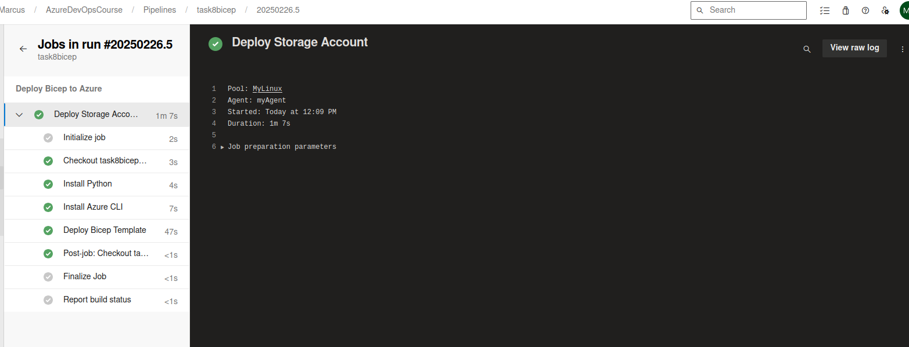
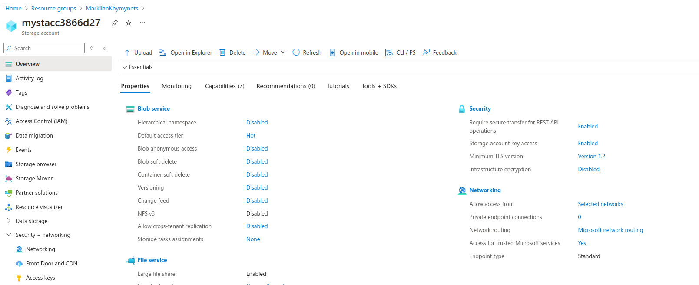

## Task 9


