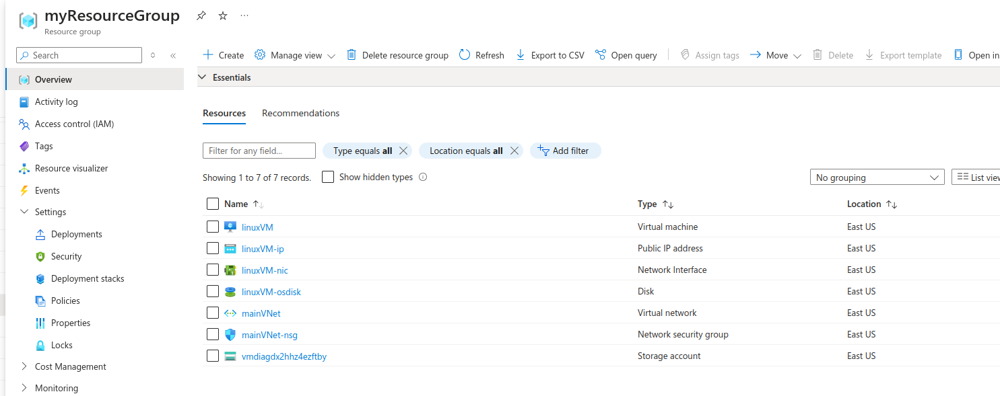
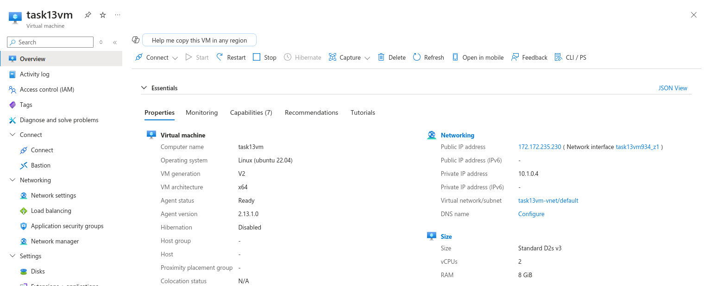
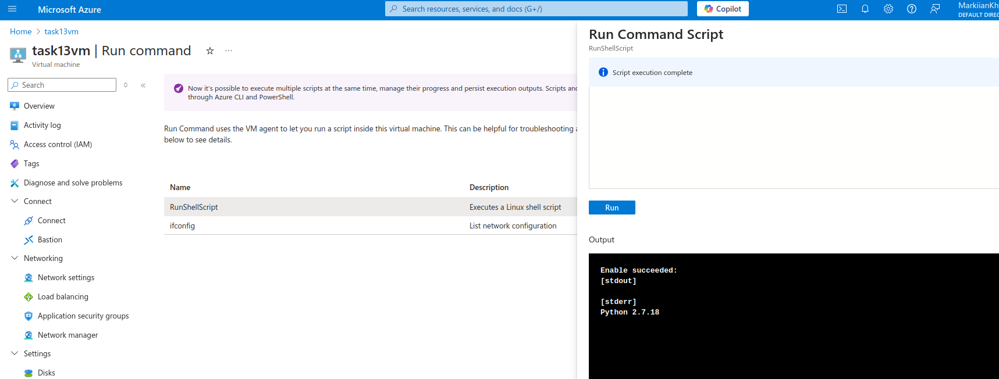
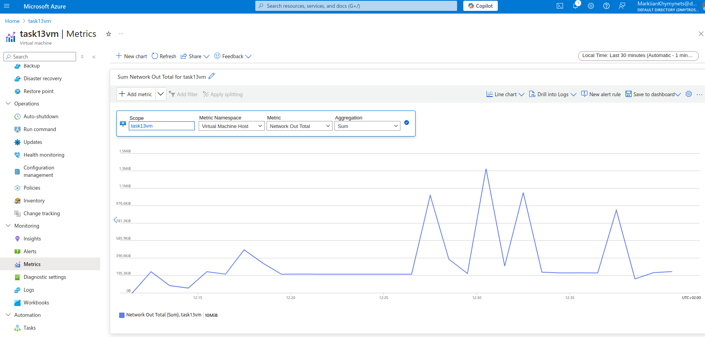
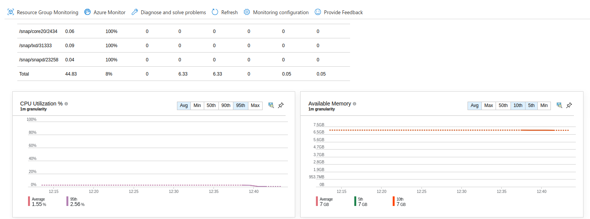
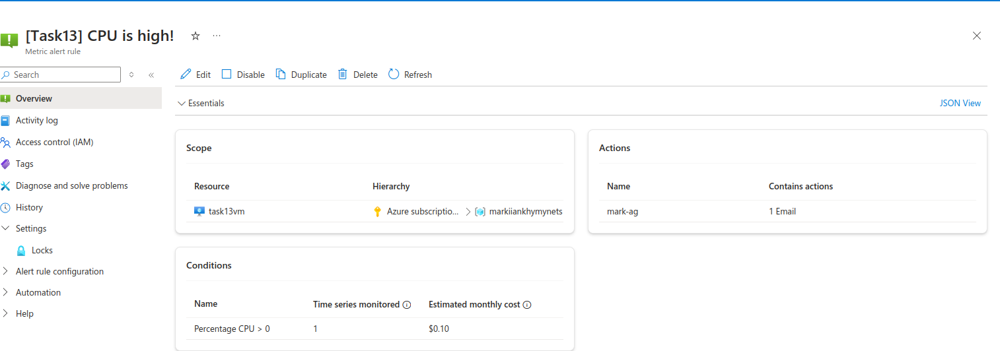
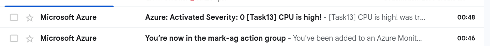

# Azure DevOps Course tasks results (Practice #6)

## Task 1
**Terraform folder and files structure aligned; dependencies installed and Azure connected**
**Setup script taken from MS Learn stuff**
```bash
#!/bin/bash

RESOURCE_GROUP_NAME=Markiianxxxxx
STORAGE_ACCOUNT_NAME=tfstate$RANDOM
CONTAINER_NAME=tfstate

# Create resource group
az group create --name $RESOURCE_GROUP_NAME --location eastus

# Create storage account
az storage account create --resource-group $RESOURCE_GROUP_NAME --name $STORAGE_ACCOUNT_NAME --sku Standard_LRS --encryption-services blob

# Create blob container
az storage container create --name $CONTAINER_NAME --account-name $STORAGE_ACCOUNT_NAME
```


## Task 2
**Terraform code for deploying resources specified in task description**
```bash
resource "azurerm_virtual_network" "practice6-vnet" {
  name                = "practice6-vnet"
  address_space       = ["10.0.0.0/16"]
  location            = data.azurerm_resource_group.practice6-rg.location
  resource_group_name = data.azurerm_resource_group.practice6-rg.name
}

resource "azurerm_subnet" "practice6-subnet" {
  name                 = "practice6-subnet"
  resource_group_name  = data.azurerm_resource_group.practice6-rg.name
  virtual_network_name = azurerm_virtual_network.practice6-vnet.name
  address_prefixes     = ["10.0.1.0/24"]
}

resource "azurerm_network_security_group" "practice6-nsg" {
  name                = "practice6-nsg"
  location            = data.azurerm_resource_group.practice6-rg.location
  resource_group_name = data.azurerm_resource_group.practice6-rg.name

  security_rule {
    name                       = "Allow-SSH"
    priority                   = 1001
    direction                  = "Inbound"
    access                     = "Allow"
    protocol                   = "Tcp"
    source_port_range          = "*"
    destination_port_range     = "22"
    source_address_prefix      = "*"
    destination_address_prefix = "*"
  }

  security_rule {
    name                       = "Allow-HTTP"
    priority                   = 1002
    direction                  = "Inbound"
    access                     = "Allow"
    protocol                   = "Tcp"
    source_port_range          = "*"
    destination_port_range     = "80"
    source_address_prefix      = "*"
    destination_address_prefix = "*"
  }
}

resource "azurerm_network_interface" "practice6-nic" {
  name                = "practice6-nic"
  location            = data.azurerm_resource_group.practice6-rg.location
  resource_group_name = data.azurerm_resource_group.practice6-rg.name

  ip_configuration {
    name                          = "internal"
    subnet_id                     = azurerm_subnet.practice6-subnet.id
    private_ip_address_allocation = "Dynamic"
    public_ip_address_id          = azurerm_public_ip.practice6-ip.id
  }
}

resource "azurerm_public_ip" "practice6-ip" {
  name                = "practice6-ip"
  location            = data.azurerm_resource_group.practice6-rg.location
  resource_group_name = data.azurerm_resource_group.practice6-rg.name
  allocation_method   = "Static"
  sku                 = "Basic"
}

resource "azurerm_network_interface_security_group_association" "practice6-association" {
  network_interface_id      = azurerm_network_interface.practice6-nic.id
  network_security_group_id = azurerm_network_security_group.practice6-nsg.id
}

resource "azurerm_linux_virtual_machine" "practice6-vm" {
  name                  = "practice6-vm"
  resource_group_name   = data.azurerm_resource_group.practice6-rg.name
  location              = data.azurerm_resource_group.practice6-rg.location
  size                  = "Standard_B1s"
  admin_username        = "azureuser"
  network_interface_ids = [azurerm_network_interface.practice6-nic.id]
  admin_ssh_key {
    username   = "azureuser"
    public_key = file("../practice2-3_terraform/id_rsa_practice2.pub")
  }

  os_disk {
    caching              = "ReadWrite"
    storage_account_type = "Standard_LRS"
    disk_size_gb         = 30
  }

  source_image_reference {
    publisher = "Canonical"
    offer     = "UbuntuServer"
    sku       = "18.04-LTS"
    version   = "latest"
  }
}

resource "null_resource" "provisioner" {
  depends_on = [azurerm_linux_virtual_machine.practice6-vm]

  provisioner "remote-exec" {
    inline = [
      "sudo apt update -y",
      "sudo apt install nginx -y"
    ]

    connection {
      type        = "ssh"
      user        = "azureuser"
      private_key = file("../practice2-3_terraform/id_rsa_practice2")
      host        = azurerm_public_ip.practice6-ip.ip_address
    }
  }
}
```

**Terraform files structure in VS Code**


**terraform apply command output and nginx website browsing**


## Task 3
**Terraform files incl. modules (compute, networking, security), variables and main file**
```bash
#compute module main.tf
data "azurerm_resource_group" "practice6-rg" {
  name = "MarkiianKhymynets"
}

resource "azurerm_public_ip" "lb" {
  name                = "${var.prefix}-lb-ip"
  location           = var.location
  resource_group_name = data.azurerm_resource_group.practice6-rg.name
  allocation_method   = "Static"
  sku                = "Standard"
}

resource "azurerm_lb" "main" {
  name                = "${var.prefix}-lb"
  location           = var.location
  resource_group_name = data.azurerm_resource_group.practice6-rg.name
  sku                = "Standard"

  frontend_ip_configuration {
    name                 = "frontend-ip"
    public_ip_address_id = azurerm_public_ip.lb.id
  }
}

resource "azurerm_lb_backend_address_pool" "main" {
  name            = "backend-pool"
  loadbalancer_id = azurerm_lb.main.id
}

resource "azurerm_lb_probe" "main" {
  name            = "http-probe"
  loadbalancer_id = azurerm_lb.main.id
  protocol        = "Http"
  port            = 80
  request_path    = "/"
}

resource "azurerm_lb_rule" "main" {
  name                           = "http-rule"
  loadbalancer_id               = azurerm_lb.main.id
  protocol                      = "Tcp"
  frontend_port                 = 80
  backend_port                  = 80
  frontend_ip_configuration_name = "frontend-ip"
  backend_address_pool_ids      = [azurerm_lb_backend_address_pool.main.id]
  probe_id                      = azurerm_lb_probe.main.id
}

resource "azurerm_virtual_machine_scale_set" "main" {
  name                = "${var.prefix}-vmss"
  location           = var.location
  resource_group_name = data.azurerm_resource_group.practice6-rg.name
  upgrade_policy_mode = "Manual"

  sku {
    name     = "Standard_DS1_v2"
    tier     = "Standard"
    capacity = 2
  }

  storage_profile_image_reference {
    publisher = "Canonical"
    offer     = "UbuntuServer"
    sku       = "18.04-LTS"
    version   = "latest"
  }

  storage_profile_os_disk {
    name              = ""
    caching           = "ReadWrite"
    create_option     = "FromImage"
    managed_disk_type = "Standard_LRS"
  }

  os_profile {
    computer_name_prefix = "vmss"
    admin_username      = "azureuser"
    admin_password      = "Password1234!"
    custom_data         = base64encode(<<-EOF
      #!/bin/bash
      apt-get update
      apt-get install -y apache2
      echo "Hello from VMSS Instance!" > /var/www/html/index.html
      EOF
    )
  }

  network_profile {
    name    = "networkprofile"
    primary = true

    ip_configuration {
      name                                   = "internal"
      subnet_id                             = var.subnet_id
      load_balancer_backend_address_pool_ids = [azurerm_lb_backend_address_pool.main.id]
      primary                               = true
    }
  }
}

resource "azurerm_monitor_autoscale_setting" "main" {
  name                = "autoscale-config"
  resource_group_name = data.azurerm_resource_group.practice6-rg.name
  location            = data.azurerm_resource_group.practice6-rg.location
  target_resource_id  = azurerm_virtual_machine_scale_set.main.id

  profile {
    name = "AutoScale"

    capacity {
      default = 2
      minimum = 2
      maximum = 10
    }

    rule {
        metric_trigger {
          metric_name        = "Percentage CPU"
          metric_resource_id = azurerm_virtual_machine_scale_set.main.id
          time_grain        = "PT1M"
          statistic         = "Average"
          time_window       = "PT5M"
          time_aggregation  = "Average"
          operator         = "GreaterThan"
          threshold        = 75
        }
        scale_action {
          direction = "Increase"
          type      = "ChangeCount"
          value     = "1"
          cooldown  = "PT1M"
        }
      }
      rule {
        metric_trigger {
          metric_name        = "Percentage CPU"
          metric_resource_id = azurerm_virtual_machine_scale_set.main.id
          time_grain        = "PT1M"
          statistic         = "Average"
          time_window       = "PT5M"
          time_aggregation  = "Average"
          operator         = "LessThan"
          threshold        = 25
        }
        scale_action {
          direction = "Decrease"
          type      = "ChangeCount"
          value     = "1"
          cooldown  = "PT1M"
        }
      }
    }
}

#networking module main.tf
data "azurerm_resource_group" "practice6-rg" {
  name = "MarkiianKhymynets"
}

resource "azurerm_virtual_network" "main" {
  name                = "${var.prefix}-vnet"
  address_space       = var.address_space
  location           = var.location
  resource_group_name = var.resource_group_name
}

resource "azurerm_subnet" "subnet1" {
  name                 = "${var.prefix}-subnet-1"
  resource_group_name  = var.resource_group_name
  virtual_network_name = azurerm_virtual_network.main.name
  address_prefixes     = [cidrsubnet(var.address_space[0], 8, 1)]
}

resource "azurerm_subnet" "subnet2" {
  name                 = "${var.prefix}-subnet-2"
  resource_group_name  = var.resource_group_name
  virtual_network_name = azurerm_virtual_network.main.name
  address_prefixes     = [cidrsubnet(var.address_space[0], 8, 2)]
}

#security module main.tf
data "azurerm_resource_group" "practice6-rg" {
  name = "MarkiianKhymynets"
}

resource "azurerm_network_security_group" "main" {
  name                = "${var.prefix}-nsg"
  location           = var.location
  resource_group_name = var.resource_group_name

  security_rule {
    name                       = "HTTP"
    priority                   = 100
    direction                  = "Inbound"
    access                     = "Allow"
    protocol                   = "Tcp"
    source_port_range          = "*"
    destination_port_range     = "80"
    source_address_prefix      = "*"
    destination_address_prefix = "*"
  }
}

# Associate NSG with subnet
resource "azurerm_subnet_network_security_group_association" "main" {
  subnet_id                 = var.subnet_id
  network_security_group_id = azurerm_network_security_group.main.id
}

#task3.tf file
resource "random_string" "storage_account_suffix" {
  length  = 8
  special = false
  upper   = false
}

# Networking Module
module "networking" {
  source              = "./modules/networking"
  resource_group_name = data.azurerm_resource_group.practice6-rg.name
  location            = var.location
  prefix              = var.prefix
  address_space       = ["10.0.0.0/16"]
}

# Security Module
module "security" {
  source              = "./modules/security"
  resource_group_name = data.azurerm_resource_group.practice6-rg.name
  location           = var.location
  prefix             = var.prefix
  subnet_id          = module.networking.subnet_id  # Add this line
}

# Compute Module (VMSS and Load Balancer)
module "compute" {
  source              = "./modules/compute"
  resource_group_name = data.azurerm_resource_group.practice6-rg.name
  location            = var.location
  prefix              = var.prefix
  subnet_id           = module.networking.subnet_id
  nsg_id              = module.security.nsg_id
}
```


## Task 4
**Ansible setup and dependencies installation**
```bash
$ sudo apt update
$ sudo apt install -y python3-pip
$ pip3 install ansible
#azure collection and requirements
$ ansible-galaxy collection install azure.azcollection
$ pip3 install -r ~/.ansible/collections/ansible_collections/azure/azcollection/requirements-azure.txt
$ $ az ad sp create-for-rbac --name "task4sp" --role Contributor --scopes /subscriptions/x-x-x-x-x/resourceGroups/Markiianxxxxx
```
**Ansible Vault**
```bash
$ ansible-vault create credentials.yml
```

**Inventory**
```bash
[azure]
localhost ansible_connection=local
```

**Ansible Playbook**
```bash
---
- name: List Azure Resource Groups
  hosts: localhost
  connection: local
  vars_files:
    - credentials.yml
  
  tasks:
    - name: Get Resource Group facts
      azure.azcollection.azure_rm_resourcegroup_info:
        client_id: "{{ AZURE_CLIENT_ID }}"
        secret: "{{ AZURE_SECRET }}"
        tenant: "{{ AZURE_TENANT }}"
        subscription_id: "{{ AZURE_SUBSCRIPTION_ID }}"
      register: rg_facts

    - name: Display Resource Groups
      debug:
        msg: "Resource Group: {{ item.name }} in location: {{ item.location }}"
      loop: "{{ rg_facts.resourcegroups }}"
```

## Task 7
**Creating json template file for ARM**
```bash
{
    "$schema": "https://schema.management.azure.com/schemas/2018-05-01/subscriptionDeploymentTemplate.json#",
    "contentVersion": "1.0.0.0",
    "parameters": {
        "rgName": {
            "type": "string",
            "defaultValue": "ARMResourceGroup",
            "metadata": {
                "description": "Name of the Resource Group"
            }
        },
        "rgLocation": {
            "type": "string",
            "defaultValue": "eastus",
            "metadata": {
                "description": "Location of the Resource Group"
            }
        },
        "tags": {
            "type": "object",
            "defaultValue": {
                "environment": "development",
                "project": "ARMDemo",
                "createdBy": "ARM Template"
            },
            "metadata": {
                "description": "Tags for the Resource Group"
            }
        }
    },
    "resources": [
        {
            "type": "Microsoft.Resources/resourceGroups",
            "apiVersion": "2021-04-01",
            "name": "[parameters('rgName')]",
            "location": "[parameters('rgLocation')]",
            "tags": "[parameters('tags')]",
            "properties": {}
        }
    ]
}
```

**Logging to Azure in CLI and applying the config**
```bash
$ az login
$ az deployment sub create \
  --location eastus \
  --template-file rg-template123987.json
```

**Listing present RGs and searching for the newly created one**


**Custom tags could be applied with the following command**
```bash
$ az deployment sub create \
  --location eastus \
  --template-file rg-template123987.json \
  --parameters tags="{'environment':'production','department':'IT','owner':'DevOps'}"
```

**Looking into the Azure Portal and checking the custom tags attached previously**


## Task 8
**ARM template file for Storage Account deployment**
```bash
{
    "$schema": "https://schema.management.azure.com/schemas/2019-04-01/deploymentTemplate.json#",
    "contentVersion": "1.0.0.0",
    "parameters": {
        "storageAccountName": {
            "type": "string",
            "metadata": {
                "description": "Name of the Storage Account"
            }
        },
        "location": {
            "type": "string",
            "defaultValue": "[resourceGroup().location]",
            "metadata": {
                "description": "Location for the Storage Account"
            }
        },
        "softDeleteRetentionDays": {
            "type": "int",
            "defaultValue": 7,
            "minValue": 1,
            "maxValue": 365,
            "metadata": {
                "description": "Number of days to retain deleted blobs"
            }
        }
    },
    "resources": [
        {
            "type": "Microsoft.Storage/storageAccounts",
            "apiVersion": "2021-09-01",
            "name": "[parameters('storageAccountName')]",
            "location": "[parameters('location')]",
            "sku": {
                "name": "Standard_LRS"
            },
            "kind": "StorageV2",
            "properties": {
                "minimumTlsVersion": "TLS1_2",
                "allowBlobPublicAccess": false,
                "publicNetworkAccess": "Enabled",
                "networkAcls": {
                    "defaultAction": "Deny",
                    "bypass": "AzureServices"
                },
                "supportsHttpsTrafficOnly": true,
                "encryption": {
                    "services": {
                        "blob": {
                            "enabled": true,
                            "keyType": "Account"
                        }
                    },
                    "keySource": "Microsoft.Storage"
                },
                "deletionPolicy": {
                    "enabled": true
                },
                "blobServiceProperties": {
                    "deleteRetentionPolicy": {
                        "enabled": true,
                        "days": "[parameters('softDeleteRetentionDays')]"
                    }
                }
            },
            "tags": {
                "environment": "production",
                "purpose": "secure-storage"
            }
        }
    ],
    "outputs": {
        "storageAccountName": {
            "type": "string",
            "value": "[parameters('storageAccountName')]"
        }
    }
}
```

**ARM template file deployment from Azure CLI**
```bash
$ STORAGE_ACCOUNT_NAME=mystorage$RANDOM
$ az deployment group create \                         
  --resource-group Markiianxxxxx \         
  --template-file storage-template123987.json \
  --parameters storageAccountName=$STORAGE_ACCOUNT_NAME

$ az storage account show --resource-group Markiianxxxxx --name $STORAGE_ACCOUNT_NAME
{
  "accessTier": "Hot",
  "accountMigrationInProgress": null,
  "allowBlobPublicAccess": false,
  "allowCrossTenantReplication": false,
  "allowSharedKeyAccess": null,
  "allowedCopyScope": null,
  "azureFilesIdentityBasedAuthentication": null,
  "blobRestoreStatus": null,
```

**Retention period modification from Azure CLI**
```bash
az deployment group create \
  --resource-group Markiianxxxxx \
  --template-file storage-template123987.json \
  --parameters storageAccountName=$STORAGE_ACCOUNT_NAME softDeleteRetentionDays=14
```

**Reviewing created Storage Account from CLI and Azure Portal**


**Clean up**
```bash
az storage account delete \
  --resource-group Markiianxxxxx \
  --name $STORAGE_ACCOUNT_NAME \
  --yes
```

## Task 10
**Template and parameters files were prepared for ARM deployment**
```bash
#vm-template.json
{
    "$schema": "https://schema.management.azure.com/schemas/2019-04-01/deploymentTemplate.json#",
    "contentVersion": "1.0.0.0",
    "parameters": {
        "vmName": {
            "type": "string",
            "metadata": {
                "description": "Name for the Virtual Machine"
            }
        },
        "adminUsername": {
            "type": "string",
            "metadata": {
                "description": "Username for the VM"
            }
        },
        "authenticationType": {
            "type": "string",
            "defaultValue": "password",
            "allowedValues": [
                "password",
                "sshPublicKey"
            ],
            "metadata": {
                "description": "Type of authentication to use on the VM"
            }
        },
        "adminPasswordOrKey": {
            "type": "securestring",
            "metadata": {
                "description": "Password or SSH key for the VM"
            }
        },
        "location": {
            "type": "string",
            "defaultValue": "[resourceGroup().location]",
            "metadata": {
                "description": "Location for all resources"
            }
        },
        "vmSize": {
            "type": "string",
            "defaultValue": "Standard_B2s",
            "metadata": {
                "description": "Size of the VM"
            }
        }
    },
    "variables": {
        "networkInterfaceName": "[concat(parameters('vmName'), '-nic')]",
        "publicIPAddressName": "[concat(parameters('vmName'), '-ip')]",
        "vnetName": "[concat(parameters('vmName'), '-vnet')]",
        "subnetName": "default",
        "nsgName": "[concat(parameters('vmName'), '-nsg')]",
        "diagnosticsStorageName": "[concat('diag', uniqueString(resourceGroup().id))]",
        "linuxConfiguration": {
            "disablePasswordAuthentication": true,
            "ssh": {
                "publicKeys": [
                    {
                        "path": "[concat('/home/', parameters('adminUsername'), '/.ssh/authorized_keys')]",
                        "keyData": "[parameters('adminPasswordOrKey')]"
                    }
                ]
            }
        }
    },
    "resources": [
        {
            "type": "Microsoft.Storage/storageAccounts",
            "apiVersion": "2021-04-01",
            "name": "[variables('diagnosticsStorageName')]",
            "location": "[parameters('location')]",
            "sku": {
                "name": "Standard_LRS"
            },
            "kind": "StorageV2"
        },
        {
            "type": "Microsoft.Network/publicIPAddresses",
            "apiVersion": "2021-02-01",
            "name": "[variables('publicIPAddressName')]",
            "location": "[parameters('location')]",
            "sku": {
                "name": "Basic"
            },
            "properties": {
                "publicIPAllocationMethod": "Dynamic"
            }
        },
        {
            "type": "Microsoft.Network/virtualNetworks",
            "apiVersion": "2021-02-01",
            "name": "[variables('vnetName')]",
            "location": "[parameters('location')]",
            "properties": {
                "addressSpace": {
                    "addressPrefixes": [
                        "10.0.0.0/16"
                    ]
                },
                "subnets": [
                    {
                        "name": "[variables('subnetName')]",
                        "properties": {
                            "addressPrefix": "10.0.0.0/24"
                        }
                    }
                ]
            }
        },
        {
            "type": "Microsoft.Network/networkSecurityGroups",
            "apiVersion": "2021-02-01",
            "name": "[variables('nsgName')]",
            "location": "[parameters('location')]",
            "properties": {
                "securityRules": [
                    {
                        "name": "SSH",
                        "properties": {
                            "priority": 1000,
                            "protocol": "Tcp",
                            "access": "Allow",
                            "direction": "Inbound",
                            "sourceAddressPrefix": "*",
                            "sourcePortRange": "*",
                            "destinationAddressPrefix": "*",
                            "destinationPortRange": "22"
                        }
                    },
                    {
                        "name": "HTTP",
                        "properties": {
                            "priority": 1001,
                            "protocol": "Tcp",
                            "access": "Allow",
                            "direction": "Inbound",
                            "sourceAddressPrefix": "*",
                            "sourcePortRange": "*",
                            "destinationAddressPrefix": "*",
                            "destinationPortRange": "80"
                        }
                    }
                ]
            }
        },
        {
            "type": "Microsoft.Network/networkInterfaces",
            "apiVersion": "2021-02-01",
            "name": "[variables('networkInterfaceName')]",
            "location": "[parameters('location')]",
            "dependsOn": [
                "[resourceId('Microsoft.Network/publicIPAddresses', variables('publicIPAddressName'))]",
                "[resourceId('Microsoft.Network/virtualNetworks', variables('vnetName'))]",
                "[resourceId('Microsoft.Network/networkSecurityGroups', variables('nsgName'))]"
            ],
            "properties": {
                "ipConfigurations": [
                    {
                        "name": "ipconfig1",
                        "properties": {
                            "privateIPAllocationMethod": "Dynamic",
                            "publicIPAddress": {
                                "id": "[resourceId('Microsoft.Network/publicIPAddresses', variables('publicIPAddressName'))]"
                            },
                            "subnet": {
                                "id": "[resourceId('Microsoft.Network/virtualNetworks/subnets', variables('vnetName'), variables('subnetName'))]"
                            }
                        }
                    }
                ],
                "networkSecurityGroup": {
                    "id": "[resourceId('Microsoft.Network/networkSecurityGroups', variables('nsgName'))]"
                }
            }
        },
        {
            "type": "Microsoft.Compute/virtualMachines",
            "apiVersion": "2021-03-01",
            "name": "[parameters('vmName')]",
            "location": "[parameters('location')]",
            "dependsOn": [
                "[resourceId('Microsoft.Network/networkInterfaces', variables('networkInterfaceName'))]",
                "[resourceId('Microsoft.Storage/storageAccounts', variables('diagnosticsStorageName'))]"
            ],
            "properties": {
                "hardwareProfile": {
                    "vmSize": "[parameters('vmSize')]"
                },
                "osProfile": {
                    "computerName": "[parameters('vmName')]",
                    "adminUsername": "[parameters('adminUsername')]",
                    "adminPassword": "[parameters('adminPasswordOrKey')]",
                    "linuxConfiguration": "[if(equals(parameters('authenticationType'), 'password'), json('null'), variables('linuxConfiguration'))]"
                },
                "storageProfile": {
                    "imageReference": {
                        "publisher": "Canonical",
                        "offer": "0001-com-ubuntu-server-focal",
                        "sku": "20_04-lts",
                        "version": "latest"
                    },
                    "osDisk": {
                        "createOption": "FromImage",
                        "managedDisk": {
                            "storageAccountType": "StandardSSD_LRS"
                        }
                    }
                },
                "networkProfile": {
                    "networkInterfaces": [
                        {
                            "id": "[resourceId('Microsoft.Network/networkInterfaces', variables('networkInterfaceName'))]"
                        }
                    ]
                },
                "diagnosticsProfile": {
                    "bootDiagnostics": {
                        "enabled": true,
                        "storageUri": "[reference(variables('diagnosticsStorageName')).primaryEndpoints.blob]"
                    }
                }
            }
        }
    ],
    "outputs": {
        "hostname": {
            "type": "string",
            "value": "[reference(variables('publicIPAddressName')).dnsSettings.fqdn]"
        },
        "publicIP": {
            "type": "string",
            "value": "[reference(resourceId('Microsoft.Network/publicIPAddresses', variables('publicIPAddressName'))).ipAddress]"
        },
        "adminUsername": {
            "type": "string",
            "value": "[parameters('adminUsername')]"
        }
    }
}
```

**CLI deploy commands**
```bash
az deployment group create \
  --resource-group Markiianxxxxx \
  --template-file vm-template.json \
  --parameters @vm-parameters.json
```

**Azure Portal resources view and connectiong to the VM**


## Task 11
**ARM Template from task 8 was converted into .bicep file**
```bash
$ az bicep decompile --file storage-template123987.json

#decompiled file content
@description('Name of the Storage Account')
param storageAccountName string

@description('Location for the Storage Account')
param location string = resourceGroup().location

@description('Number of days to retain deleted blobs')
@minValue(1)
@maxValue(365)
param softDeleteRetentionDays int = 7

resource storageAccount 'Microsoft.Storage/storageAccounts@2021-09-01' = {
  name: storageAccountName
  location: location
  sku: {
    name: 'Standard_LRS'
  }
  kind: 'StorageV2'
  properties: {
    minimumTlsVersion: 'TLS1_2'
    allowBlobPublicAccess: false
    publicNetworkAccess: 'Enabled'
    networkAcls: {
      defaultAction: 'Deny'
      bypass: 'AzureServices'
    }
    supportsHttpsTrafficOnly: true
    encryption: {
      services: {
        blob: {
          enabled: true
          keyType: 'Account'
        }
      }
      keySource: 'Microsoft.Storage'
    }
    deletionPolicy: {
      enabled: true
    }
    blobServiceProperties: {
      deleteRetentionPolicy: {
        enabled: true
        days: softDeleteRetentionDays
      }
    }
  }
  tags: {
    environment: 'production'
    purpose: 'secure-storage'
  }
}

output storageAccountName string = storageAccountName
```


**Creating parameters.json file**
```bash
{
    "$schema": "https://schema.management.azure.com/schemas/2019-04-01/deploymentParameters.json#",
    "contentVersion": "1.0.0.0",
    "parameters": {
        "storageAccountName": {
            "value": "mystd3lkbjij43985"
        },
        "location": {
            "value": "eastus"
        },
        "softDeleteRetentionDays": {
            "value": 7
        }
    }
}
```
**Applying Bicep deployment**
```bash
$ az deployment group create   --resource-group Markiianxxxxx   --template-file storage-template123987.bicep   --parameters @parameters.json
```

**Checking Azure Portal for newly created Storage Account**


**Clean up**
```bash
# Delete the storage account
$ az storage account delete \
  --name mystd3lkbjij43985 \
  --resource-group Markiianxxxxx \
  --yes
```
## Task 11 (2)
**Describing Bicep files used for task**
```bash 
#main.bicep
// main.bicep

// Parameters
param location string = resourceGroup().location
param vmName string = 'linuxVM'
param adminUsername string = 'azureuser'
param vnetName string = 'mainVNet'
param storageAccountName string = 'vmdiag${uniqueString(resourceGroup().id)}'

@secure()
param adminPublicKey string

// Variables
var networkingModuleName = 'networking'
var vmModuleName = 'virtualmachine'

// Storage Account
resource storageAccount 'Microsoft.Storage/storageAccounts@2021-08-01' = {
  name: storageAccountName
  location: location
  sku: {
    name: 'Standard_LRS'
  }
  kind: 'StorageV2'
  properties: {
    accessTier: 'Hot'
    supportsHttpsTrafficOnly: true
  }
}

// Networking Module
module networking './modules/networking.bicep' = {
  name: networkingModuleName
  params: {
    location: location
    vnetName: vnetName
  }
}

// Virtual Machine Module
module virtualmachine './modules/virtualmachine.bicep' = {
  name: vmModuleName
  params: {
    location: location
    vmName: vmName
    adminUsername: adminUsername
    adminPublicKey: adminPublicKey
    subnetId: networking.outputs.subnetId
    diagStorageAccountName: storageAccount.name
  }
}

// Outputs
output vmPublicIP string = virtualmachine.outputs.publicIPAddress
output vnetName string = networking.outputs.vnetName
```
```bash
#modules/networking.bicep
// modules/networking.bicep

param location string
param vnetName string

// Variables
var addressPrefix = '10.0.0.0/16'
var subnetName = 'default'
var subnetPrefix = '10.0.0.0/24'
var nsgName = '${vnetName}-nsg'

// Network Security Group
resource nsg 'Microsoft.Network/networkSecurityGroups@2021-05-01' = {
  name: nsgName
  location: location
  properties: {
    securityRules: [
      {
        name: 'AllowSSH'
        properties: {
          priority: 1000
          access: 'Allow'
          direction: 'Inbound'
          destinationPortRange: '22'
          protocol: 'Tcp'
          sourceAddressPrefix: '*'
          sourcePortRange: '*'
          destinationAddressPrefix: '*'
        }
      }
    ]
  }
}

// Virtual Network
resource vnet 'Microsoft.Network/virtualNetworks@2021-05-01' = {
  name: vnetName
  location: location
  properties: {
    addressSpace: {
      addressPrefixes: [
        addressPrefix
      ]
    }
    subnets: [
      {
        name: subnetName
        properties: {
          addressPrefix: subnetPrefix
          networkSecurityGroup: {
            id: nsg.id
          }
        }
      }
    ]
  }
}

// Outputs
output vnetName string = vnet.name
output subnetId string = vnet.properties.subnets[0].id
```
```bash
#virtualmachine.bicep
// modules/virtualmachine.bicep

param location string
param vmName string
param adminUsername string
param subnetId string
param diagStorageAccountName string

@secure()
param adminPublicKey string

// Variables
var publicIPName = '${vmName}-ip'
var nicName = '${vmName}-nic'
var osDiskName = '${vmName}-osdisk'

// Public IP
resource publicIP 'Microsoft.Network/publicIPAddresses@2021-05-01' = {
  name: publicIPName
  location: location
  sku: {
    name: 'Standard'
  }
  properties: {
    publicIPAllocationMethod: 'Static'
  }
}

// Network Interface
resource nic 'Microsoft.Network/networkInterfaces@2021-05-01' = {
  name: nicName
  location: location
  properties: {
    ipConfigurations: [
      {
        name: 'ipconfig1'
        properties: {
          privateIPAllocationMethod: 'Dynamic'
          subnet: {
            id: subnetId
          }
          publicIPAddress: {
            id: publicIP.id
          }
        }
      }
    ]
  }
}

// Virtual Machine
resource vm 'Microsoft.Compute/virtualMachines@2021-11-01' = {
  name: vmName
  location: location
  properties: {
    hardwareProfile: {
      vmSize: 'Standard_B2s'  // Can be modified for different sizes
    }
    osProfile: {
      computerName: vmName
      adminUsername: adminUsername
      linuxConfiguration: {
        disablePasswordAuthentication: true
        ssh: {
          publicKeys: [
            {
              path: '/home/${adminUsername}/.ssh/authorized_keys'
              keyData: adminPublicKey
            }
          ]
        }
      }
    }
    storageProfile: {
      imageReference: {
        publisher: 'Canonical'
        offer: 'UbuntuServer'
        sku: '18.04-LTS'
        version: 'latest'
      }
      osDisk: {
        name: osDiskName
        createOption: 'FromImage'
        managedDisk: {
          storageAccountType: 'StandardSSD_LRS'
        }
      }
    }
    networkProfile: {
      networkInterfaces: [
        {
          id: nic.id
        }
      ]
    }
    diagnosticsProfile: {
      bootDiagnostics: {
        enabled: true
        storageUri: 'https://${diagStorageAccountName}.blob.core.windows.net'
      }
    }
  }
}

// Outputs
output publicIPAddress string = publicIP.properties.ipAddress
```

**Commands used for deployment**
```bash
$ az group create --name myResourceGroup --location eastus
$ az deployment group create \
  --resource-group myResourceGroup \
  --template-file main.bicep \
  --parameters adminPublicKey="xxxxx"
```

**Services deployment and validation via SSH connection and Portal overview**



**Clean up**
```bash
$ az group delete --name myResourceGroup --yes
```

## Task 12 (skipped as optional)
## Task 13 
**Linux VM created for testing (Ubuntu 22.04)**


**Prerequisites installed for Diagnostics (python2)**


**Network Out metric review on the metrics tab**




**Creating sample metrics alert and testing it's triggering (Action Group)**




