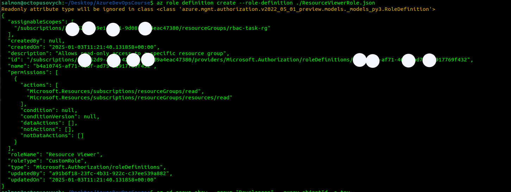
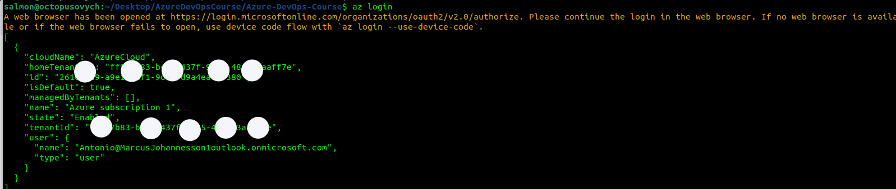

# Azure DevOps Course tasks results (Practice #1)

## Task 1

**Custom tenant created after Entra ID P2 trial activated**


**Users created**


**Admins and Devs Groups**


**Dev group role assignment**


**User added to the relevant group**


**Permissions inheritance example on second user**


## Task 2 (skipped)

## Task 3
**Resource Viewer custom role JSON file**


**Role definition created**


**Roles assignment sample command**


**Admins group role verification**


**Developers group role verification (no permissions to use View my access, but Resource group is visible, so assignment is successful)**


## Task 4
**Azure Key Vault created**


**No list access for user Marcus**


**Access policy applied for Developers group**


**Antonio from Devs group logged in via CLI**


**Secret retrieval using CLI (created earlier)**


## Task 5
**Key Vault deployment**


**Policy definition**


**Policy assignment**


**Policy state evalueation for specific Resource Group**
```bash
$ az policy state trigger-scan --resource-group "azure-devops-rg"
```

**Non-compliant policy**


**Non-compliant resource detailed view**


**Optional: Deny policy in action**


