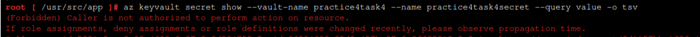

# Azure DevOps Course tasks results (Practice #4)

## Task 1

**Sample Flask application written in Python**


**Application dependencies described in requirements.txt**


**Sample Dockerfile for application dockerizing**


**Azure Container Registry created with Admin access enabled (for ACI usage)**


**Building docker image locally in the Ubuntu CLI**
```bash
docker build -t practice4task1.azurecr.io/flask-aci-app:v1 .
```

**Fixing local issue with DNS resolution (thanks to StackOverFlow)**
```bash
 Step 4/7 : RUN pip install -r requirements.txt
 ---> Running in 7f4635a7510a
Collecting Flask (from -r requirements.txt (line 1))

Retrying (Retry(total=4, connect=None, read=None, redirect=None)) after 
connection broken by
'NewConnectionError('<pip._vendor.requests.packages.urllib3.connection.VerifiedHTTPSConnection 
object at 0x7fe3984d9b10>: Failed to establish a new connection: 
[Errno -3] Temporary failure in name resolution',)': /simple/flask/

```
```bash
#FIX:
$ sudo vi /etc/docker/daemon.json
{
    "dns": ["8.8.8.8", "8.8.4.4"]
}
$ sudo service docker restart
```

**Login to ACR and pushing the docker image**
```bash
az acr login --name practice4task1
docker push practice4task1.azurecr.io/flask-aci-app:v1
```

**Azure Container Instance created and linked to ACR**


**Sample Flask application deployed using ACI+ACR**


## Task 2
**Modified sample code for Flask application written in Python**


**Logging into ACR, building and pushing new docker image**
```bash
 $ az acr login --name practice4task1
 $ docker build -t practice4task1.azurecr.io/flask-aci-app:v2 .
 $ docker push practice4task1.azurecr.io/flask-aci-app:v2
```
**New ACI container deployed with MESSAGE environment variable specified**


**Browsing <public IP>:5000 for application demo**


## Task 3
**Bash script for deploying sample Azure Container App service**
```bash
#!/bin/bash

set -e

echo "Adding Azure Container Apps extension to Azure CLI"
# az extension add -n containerapp --upgrade

echo "Ensuring Microsoft.Web and Microsoft.App providers are registered with current Azure Subscription"
# az provider register --namespace Microsoft.Web
# az provider register --namespace Microsoft.App


rgName=MarkiianKhymynets
location=eastus

acaEnvironmentName=env-practice4task3
lawName=practice4task3
image=thorstenhans/gopher:hero

echo "Creating Log Analytics Workspace"

lawClientId=$(az monitor log-analytics workspace create --workspace-name $lawName -g $rgName --query customerId -o tsv)
lawClientSecret=$(az monitor log-analytics workspace get-shared-keys -n $lawName -g $rgName --query primarySharedKey -o tsv)

echo "Creating Azure Container App Environment"

az containerapp env create -n $acaEnvironmentName -g $rgName --logs-workspace-id $lawClientId --logs-workspace-key $lawClientSecret -l $location
echo ""

echo "Deploying Container to Azure Container App"

fqdn=$(az containerapp create -n hello-aca -g $rgName --environment $acaEnvironmentName --image $image --target-port 8080 --ingress external --query configuration.ingress.fqdn -o tsv)
echo ""

echo -e "Our Azure Container App is up and running at https://${fqdn}"
```

**Azure Container App successfully deployed**


**Browsing sample application URL**


**Scaling to 3 replicas using new revision/deployment**


**Replicas detailed overview on the Azure Portal**


## Task 4
**Azure Container Instance created with hello-world container**


**Browsing the Public IP address of the container**


**Enabling system-managed identity for ACI service**


**Assigning our Identity with Key Vault Reader role (onle metadata view)**


**Testing on reading the metadata and the actual Secret created before**



**Assigning the needed role for secret retrieval e.g Secret User**


**Testing Secret retrieval from our ACI container environment**


## Task 5
**Azure Kubernetes Service cluster created (dev/test, D-series node pool 1-3)**


**Logging into cluster environment using Azure CloudShell and interacting with cluster**
```bash
Requesting a Cloud Shell.Succeeded. 
Connecting terminal...

Welcome to Azure Cloud Shell

Type "az" to use Azure CLI
Type "help" to learn about Cloud Shell

Your Cloud Shell session will be ephemeral so no files or system changes will persist beyond your current session.
x [ ~ ]$ az aks get-credentials --resource-group xxx --name practice4task5

Merged "practice4task5" as current context in /home/x/.kube/config

x [ ~ ]$ kubectl get nodes

NAME                                STATUS   ROLES    AGE    VERSION
aks-agentpool-39279877-vmss000000   Ready    <none>   7m6s   v1.30.7

x [ ~ ]$ kubectl get pods
No resources found in default namespace.
x [ ~ ]$ kubectl get pods -n=system
No resources found in system namespace.

x [ ~ ]$ kubectl create deployment nginx --image=nginx
deployment.apps/nginx created

x [ ~ ]$ kubectl expose deployment nginx --port=80 --type=LoadBalancer
service/nginx exposed

x [ ~ ]$ kubectl get pods
NAME                    READY   STATUS    RESTARTS   AGE
nginx-bf5d5cf98-299lh   1/1     Running   0          22s

x [ ~ ]$ kubectl get svc
NAME         TYPE           CLUSTER-IP     EXTERNAL-IP     PORT(S)        AGE
kubernetes   ClusterIP      10.0.0.1       <none>          443/TCP        9m15s
nginx        LoadBalancer   10.0.117.112   64.236.77.138   80:31366/TCP   16s
```
**Nginx default page overview browsing the EXTERNAL-IP provided above**


## Task 6
**AKS cluster from task 5 was used**
**Sample node.js application code**
```bash
#server.js
const http = require('http');
const port = process.env.PORT || 3000;

const requestHandler = (req, res) => {
  res.end('Hello from AKS!');
};

const server = http.createServer(requestHandler);
server.listen(port, () => {
  console.log(`Server running on port ${port}`);
});
```

```bash
#package.json
{
  "name": "simple-node-app",
  "version": "1.0.0",
  "main": "server.js",
  "scripts": {
    "start": "node server.js"
  },
  "dependencies": {
    "http": "^0.0.1-security"
  }
}
```

```bash
#Dockerfile
FROM node:18-alpine

WORKDIR /app

COPY package.json .

COPY server.js .

RUN npm install

EXPOSE 3000

CMD ["npm", "start"]
```
**Logging into ACR created in task 1, building the image and pushing to repository**
```bash
az acr login --name practice4task1
az acr build --registry practice4task1 --image simple-node-app:v1 .
az acr repository list --name practice4task1 --output table
```

**Getting into the cluster environment from local Ubuntu CLI**
```bash
az aks get-credentials --resource-group xxxxx --name practice4task5
```

**Manifest file for node.js app deployment**
```bash
#app-deployment.yaml
apiVersion: apps/v1
kind: Deployment
metadata:
  name: simple-node-app
spec:
  replicas: 1
  selector:
    matchLabels:
      app: simple-node-app
  template:
    metadata:
      labels:
        app: simple-node-app
    spec:
      containers:
      - name: simple-node-app
        image: practice4task1.azurecr.io/simple-node-app:v1
        ports:
        - containerPort: 3000
---
apiVersion: v1
kind: Service
metadata:
  name: simple-node-app-service
spec:
  type: LoadBalancer
  selector:
    app: simple-node-app
  ports:
    - protocol: TCP
      port: 80
      targetPort: 3000
```

**Attaching ACR to AKS using az CLI**
```bash
az aks update -n practice4task5 -g xxxxx --attach-acr practice4task1
AAD role propagation done[############################################]  100.000 - Running ..
```

**Optional: Another option would be to create a secret to access ACR**
```bash 
kubectl create secret docker-registry acr-secret \
  --docker-server=<xxxxx>.azurecr.io \
  --docker-username=<xxxxx> \
  --docker-password=<xxxxx> \
  --docker-email=<xxxxx>
```
```bash
spec:
  containers:
  - name: simple-node-app
    image: <xxxxxx>.azurecr.io/simple-node-app:v1
    ports:
    - containerPort: 3000
  imagePullSecrets:
  - name: acr-secret
```

**Applying manifest file and checking the PUBLIC-IP in the browser**
```bash
kubectl get services
NAME                      TYPE           CLUSTER-IP     EXTERNAL-IP     PORT(S)        AGE
kubernetes                ClusterIP      10.0.0.1       <none>          443/TCP        59m
simple-node-app-service   LoadBalancer   10.0.72.81     64.236.107.94   80:30093/TCP   15m
```


## Task 7
**Creating ConfigMap and Secret using the AKS cluster from previous task**
```bash
#configmap.yaml
apiVersion: v1
kind: ConfigMap
metadata:
  name: app-config
data:
  APP_ENV: "production"
  APP_VERSION: "1.0.0"
```

```bash
kubectl apply -f configmap.yaml

kubectl get configmap app-config -o yaml

apiVersion: v1
data:
  APP_ENV: production
  APP_VERSION: 1.0.0
kind: ConfigMap
metadata:
  annotations:
    kubectl.kubernetes.io/last-applied-configuration: |
      {"apiVersion":"v1","data":{"APP_ENV":"production","APP_VERSION":"1.0.0"},"kind":"ConfigMap","metadata":{"annotations":{},"name":"app-config","namespace":"default"}}
  creationTimestamp: "2025-02-02T21:19:15Z"
  name: app-config
  namespace: default
  resourceVersion: "106908"
  uid: e1116220-7e21-484b-bcfb-xxxxx
```

```bash
#secret.yaml
apiVersion: v1
kind: Secret
metadata:
  name: app-secret
type: Opaque
data:
  API_KEY: bXktc2VjcmV0LWFwaS1rZXk=   # This is base64 encoded for "my-secret-api-key"
```

```bash
kubectl apply -f secret.yaml

kubectl get secret app-secret -o yaml

apiVersion: v1
data:
  API_KEY: bXktc2VjcmV0LWFwaS1rZXk=
kind: Secret
metadata:
  annotations:
    kubectl.kubernetes.io/last-applied-configuration: |
      {"apiVersion":"v1","data":{"API_KEY":"bXktc2VjcmV0LWFwaS1rZXk="},"kind":"Secret","metadata":{"annotations":{},"name":"app-secret","namespace":"default"},"type":"Opaque"}
  creationTimestamp: "2025-02-02T21:23:45Z"
  name: app-secret
  namespace: default
  resourceVersion: "107982"
  uid: c8a6d4f4-c91a-4679-ba37-xxxxx
type: Opaque
```

**Manifest file for node.js app with Secret and ConfigMap usage**
```bash
#app-with-configmap-and-secret.yaml
apiVersion: apps/v1
kind: Deployment
metadata:
  name: simple-node-app
spec:
  replicas: 1
  selector:
    matchLabels:
      app: simple-node-app
  template:
    metadata:
      labels:
        app: simple-node-app
    spec:
      containers:
      - name: simple-node-app
        image: practice4task1.azurecr.io/simple-node-app:v1
        ports:
        - containerPort: 3000
        env:
        - name: APP_ENV
          valueFrom:
            configMapKeyRef:
              name: app-config
              key: APP_ENV
        - name: APP_VERSION
          valueFrom:
            configMapKeyRef:
              name: app-config
              key: APP_VERSION
        - name: API_KEY
          valueFrom:
            secretKeyRef:
              name: app-secret
              key: API_KEY
---
apiVersion: v1
kind: Service
metadata:
  name: simple-node-app-service
spec:
  type: LoadBalancer
  selector:
    app: simple-node-app
  ports:
    - protocol: TCP
      port: 80
      targetPort: 3000
```

**Validating that ConfigMap and Secret were used in the pods**
```bash
kubectl exec -it simple-node-app-cd9bd97b9-7mdvd -- printenv | grep APP_
APP_ENV=production
APP_VERSION=1.0.0
SIMPLE_NODE_APP_SERVICE_PORT=tcp://10.0.72.81:80
SIMPLE_NODE_APP_SERVICE_PORT_80_TCP_ADDR=10.0.72.81
SIMPLE_NODE_APP_SERVICE_PORT_80_TCP_PROTO=tcp
SIMPLE_NODE_APP_SERVICE_SERVICE_PORT=80
SIMPLE_NODE_APP_SERVICE_PORT_80_TCP=tcp://10.0.72.81:80
SIMPLE_NODE_APP_SERVICE_SERVICE_HOST=10.0.72.81
SIMPLE_NODE_APP_SERVICE_PORT_80_TCP_PORT=80
```
```bash
kubectl exec -it simple-node-app-cd9bd97b9-7mdvd -- printenv | grep API_KEY
API_KEY=my-secret-api-key
```
## Task 8
**Simple Nginx deployment to our AKS cluster**
```bash
apiVersion: apps/v1
kind: Deployment
metadata:
  name: nginx-app
spec:
  replicas: 1
  selector:
    matchLabels:
      app: nginx-app
  template:
    metadata:
      labels:
        app: nginx-app
    spec:
      containers:
      - name: nginx
        image: nginx:latest
        resources:
          requests:
            cpu: "100m"
            memory: "128Mi"
          limits:
            cpu: "200m"
            memory: "256Mi"
        ports:
        - containerPort: 80
---
apiVersion: v1
kind: Service
metadata:
  name: nginx-app-service
spec:
  type: LoadBalancer
  selector:
    app: nginx-app
  ports:
    - protocol: TCP
      port: 80
      targetPort: 80
```

**Manually scaling the deployment in the CLI**
```bash
kubectl scale deployment nginx-app --replicas=3
```

**Setting up a Horizontal Pod Autoscaler (HPA)**
```bash
kubectl get deployment metrics-server -n kube-system

kubectl apply -f https://github.com/kubernetes-sigs/metrics-server/releases/latest/download/components.yaml

kubectl autoscale deployment nginx-app --cpu-percent=50 --min=1 --max=5
```

**Simulation the load using stress tool running on one of the pods**
```bash
kubectl exec -it <nginx-pod-name> -- sh

apt-get update && apt-get install -y stress

stress --cpu 2 --timeout 300
```

**HPA in action after stress is overloading our pod**


## Task 9
**Prerequisite files for simple application**
```bash
#index.html
<!DOCTYPE html>
<html>
<head>
  <title>Version 1</title>
</head>
<body style="background-color: lightblue; text-align: center;">
  <h1>Welcome to Version 1 🚀</h1>
</body>
</html>
```

```bash
#Dockerfile
FROM nginx:alpine
COPY index.html /usr/share/nginx/html/index.html
```

**Building and pushing image V1 to Azure Container Registry**
```bash
docker build -t practice4task1.azurecr.io/simple-app:v1 .

az acr login --name practice4task1

docker push practice4task1.azurecr.io/simple-app:v1
```

```bash
#deployment.yaml
apiVersion: apps/v1
kind: Deployment
metadata:
  name: simple-app
spec:
  replicas: 2
  selector:
    matchLabels:
      app: simple-app
  template:
    metadata:
      labels:
        app: simple-app
    spec:
      containers:
      - name: simple-app
        image: practice4task1.azurecr.io/simple-app:v1
        ports:
        - containerPort: 80
---
apiVersion: v1
kind: Service
metadata:
  name: simple-app-service
spec:
  type: LoadBalancer
  ports:
  - port: 80
    targetPort: 80
  selector:
    app: simple-app
```

**Browsing EXTERNAL-IP provided by LoadBalancer service in CLI output**


**Changing the content of our index.html to version 2.0 e.g color change**
```bash
#index.html version 2.0
<!DOCTYPE html>
<html>
<head>
  <title>Version 2</title>
</head>
<body style="background-color: lightgreen; text-align: center;">
  <h1>Welcome to Version 2 🚀</h1>
</body>
</html>
```

**Building new image and pushing to the Azure Container Registry with tag v2**
```bash
docker build -t practice4task1.azurecr.io/simple-app:v2 .
docker push practice4task1.azurecr.io/simple-app:v2
```

**Performing rolling update from the CLI**
```bash
kubectl set image deployment/simple-app simple-app=practice4task1.azurecr.io/simple-app:v2
```

**Reviewing rolling update status and monitoring for any changes in the application**


**PS Rolling update is a default strategy for AKS. Other ones: Blue/Green, Canary, A/B Testing**

## Bonus task
**Simple app from previous task was used (ACR image and deployment.yaml)**

**Workflow**
```bash
1) ArgoCD CLI installed
2) Separate namespace created
$ kubectl create namespace argocd
3) ArgoCD installed
$ kubectl apply -n argocd -f https://raw.githubusercontent.com/argoproj/argo-cd/stable/manifests/install.yaml
4) Public IP exposed
$ kubectl patch svc argocd-server -n argocd -p '{"spec": {"type": "LoadBalancer"}}'
5) Admin password
$ kubectl -n argocd get secret argocd-initial-admin-secret -o jsonpath="{.data.password}" | base64 -d && echo
6) Private GitHub repository prepared with Personal Access Token generated
7) Adding repo to ArgoCD
$ argocd repo add https://github.com/xxxxx/aks-gitops-demo.git \
  --username xxxxx \
  --password xxxxx
8) Application created in ArgoCD web UI (repo added as source, AKS cluster with default namespace as destination)
```
**Results: ArgoCD web UI and application after deployment.yaml pushed to repo and synced**


**Some changes to the deployment.yaml were pushed (v1-->v2)**


