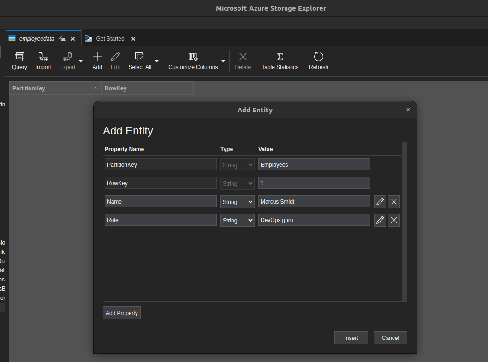
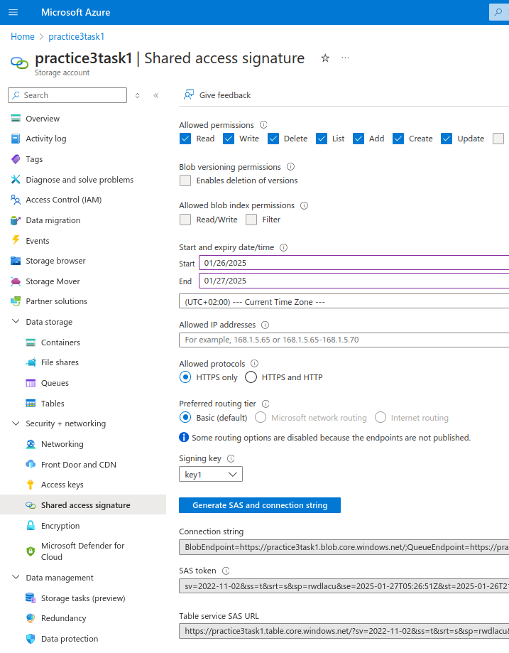

# Azure DevOps Course tasks results (Practice #3)
## Task 1

**Azure Storage Account and Blob container created**


**Storage Exlorer installed on Ubuntu 22 localhost machine**


**Sample file uploaded via Azure Portal**


**Sample file retrieval (downloading on the local machine)**


**New file added locally via Storage Explorer**
.png)


## Task 2
**Sample files uploaded**


**Data Management Lifecycle Rule added**


**Moving to cool access tier after 0 days (for testing purposes, IRL would be closer to 14-30 days)**


**Blob filtering with full path or prefix naming (blob indexing also as an option)**


**Different tiers overview (difference between accessing and storage costs)**


## Task 3
**Azure Queue service created via an Azure Portal**


**Azure Queue populated with the sample message**


**Message content reviewing inside Azure Storage Explorer on the local machine**


**Testing multiple messages requeuing (Azure Storage Explorer)**


**Testing multiple message dequeuing (Azure Storage Explorer)**


## Task 4
**Prerequisites commands executed**
```bash
sudo apt-get install keyutils 

sudo apt-get install cifs-utils
```
**Azure File Share created**


**Sample objects uploaded to the File Share using Azure Portal**


**Connection script available in Azure Portal (executed on local Ubuntu 22 machine)**
```bash
sudo mkdir /mnt/practice3fileshare
if [ ! -d "/etc/smbcredentials" ]; then
sudo mkdir /etc/smbcredentials
fi
if [ ! -f "/etc/smbcredentials/practice3task1.cred" ]; then
    sudo bash -c 'echo "username=xxxxxx" >> /etc/smbcredentials/practice3task1.cred'
    sudo bash -c 'echo "password=xxxxxx" >> /etc/smbcredentials/practice3task1.cred'
fi
sudo chmod 600 /etc/smbcredentials/practice3task1.cred

sudo bash -c 'echo "//xxxxx.file.core.windows.net/xxxxx /mnt/practice3fileshare cifs nofail,credentials=/etc/smbcredentials/practice3task1.cred,dir_mode=0777,file_mode=0777,serverino,nosharesock,actimeo=30" >> /etc/fstab'
sudo mount -t cifs //xxxxx.file.core.windows.net/xxxxx /mnt/practice3fileshare -o credentials=/etc/smbcredentials/practice3task1.cred,dir_mode=0777,file_mode=0777,serverino,nosharesock,actimeo=30
```

**New file added from the local Ubuntu machine**


**Sample file added locally is also visible in the Azure Portal**


**Cleaning up**
```bash
sudo umount /mnt/practice3fileshare
sudo rm -rf /mnt/practice3fileshare
df -h | grep practice3fileshare
```
## Task 5
**Azure Storage Table overview**


**Populating the table with some data**


**Running table queries**


**Deleting table entities using specific properties**


```bash
az storage entity delete \
  --account-name practice3task1 \
  --account-key ${storage-access-key} \
  --table-name employeedata \
  --partition-key Employees \
  --row-key 1
```

## Task 6
**Creating SAS token for testing blob access (read-only access)**


**Connecting to the blob using Azure Storage Explorer and SAS URL**


**Testing blob operations (e.g file upload)**


**Creating SAS token for testing file share access (read and write access)**


**Testing file share operations(aploading a file to file share)**


**Creating SAS token for testing table operations(full access)**


**Connecting to the table using SAS token**


**Testing table operations (deleting the table from Storage Explorer directly)**


**Cleaning up the SAS token accesses by rotating signing key (key1)**


## Task 7
**Creating an Azure Service Principal with Blob Data Contributor role**
```bash
az ad sp create-for-rbac --name "secure-storage-sp" --role "Storage Blob Data Contributor" --scopes /subscriptions/xxxxx/resourceGroups/xxxxx/providers/Microsoft.Storage/storageAccounts/practice3task1
```
**Logging from Azure CLI terminal using the IDs provided after SP creation**
```bash
az login --service-principal \
  --username xxxxx \
  --password yyyyy \
  --tenant zzzzz
```

**Testing assigned role for Service Principal by uploading a sample file**
```bash
 az storage blob upload \
  --account-name practice3task1 \
  --container-name practice3container \
  --name test.txt \
  --file ~/Desktop/samplefile.txt \
  --auth-mode login
```

**The sample file was successfully uploaded to Azure Storage Account blob container**


**Creating another Service Principal with insufficient permissions**
```bash
az ad sp create-for-rbac --name "secure-storage-sp-test" --role "Storage Blob Data Reader" --scopes xxxxx/resourceGroups/xxxxx/providers/Microsoft.Storage/storageAccounts/practice3task1
```

**Testing file upload with our newly created Service Principal (no access to Blob)**


**Azure Virtual Machine created with Managed Identity**
```bash
az vm create \
  --name task7vm-managed-test \
  --resource-group xxxxx \
  --image Ubuntu2204 \
  --admin-username azureuser \
  --admin-password ${adminpwd} \
  --assign-identity "/subscriptions/xxxxx/resourceGroups/MarkiianKhymynets/providers/Microsoft.ManagedIdentity/userAssignedIdentities/task7-managed-identity"
{
  "fqdns": "",
  "id": "/subscriptions/xxxxx/resourceGroups/xxxxx/providers/Microsoft.Compute/virtualMachines/task7vm-managed-test",
  "identity": {
    "systemAssignedIdentity": "",
    "userAssignedIdentities": {
      "/subscriptions/xxxxx/resourceGroups/xxxxx/providers/Microsoft.ManagedIdentity/userAssignedIdentities/task7-managed-identity": {
        "clientId": "xxxxx",
        "principalId": "xxxxx"
      }
    }
  },
  "location": "centralus",
  "macAddress": "xxxxx",
  "powerState": "VM running",
  "privateIpAddress": "10.0.0.4",
  "publicIpAddress": "xxxxx",
  "resourceGroup": "xxxxx",
  "zones": ""
}
```

**Role Assignment with System-Managed Identity for Blob access**


**Accessing the blob from the Azure Virtual Machine CLI**
```bash
az login --identity --username xxxxx
```
```bash
az storage blob list \
  --account-name practice3task1 \
  --container-name practice3container \
  --auth-mode login
```

```bash
[
  {
    "container": "practice3container",
    "content": "",
    "deleted": null,
    "encryptedMetadata": null,
    "encryptionKeySha256": null,
    "encryptionScope": null,
    "hasLegalHold": null,
    "hasVersionsOnly": null,
    "immutabilityPolicy": {
      "expiryTime": null,
      "policyMode": null
    },
    "isAppendBlobSealed": null,
    "isCurrentVersion": null,
    "lastAccessedOn": null,
    "metadata": {},
    "name": "1984-Orwell.epub",
    "objectReplicationDestinationPolicy": null,
    "objectReplicationSourceProperties": [],
    "properties": {
```


