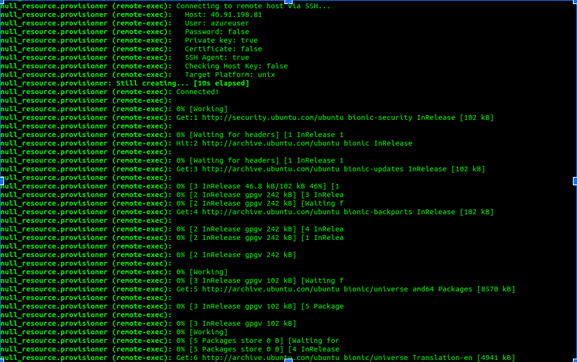
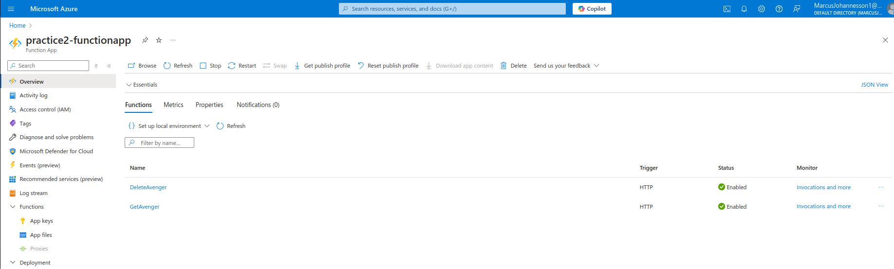

# Azure DevOps Course tasks results (Practice #2)
## Task 1
**Initial terraform setup (remote backend)**
```bash
terraform {
  required_providers {
    azurerm = {
      source  = "hashicorp/azurerm"
      version = "~>3.0"
    }
  }
  backend "azurerm" {
    resource_group_name  = "practice2-rg"
    storage_account_name = "tfstatexxxx"
    container_name       = "tfstate"
    key                  = "terraform.tfstate"
  }
}
```

**Code for resources deployment required for task completion**
```bash
provider "azurerm" {
  features {}
}

data "azurerm_resource_group" "practice2-rg" {
  name = "practice2-rg"
}

resource "azurerm_virtual_network" "practice2-vnet" {
  name                = "practice2-vnet"
  address_space       = ["10.0.0.0/16"]
  location            = data.azurerm_resource_group.practice2-rg.location
  resource_group_name = data.azurerm_resource_group.practice2-rg.name
}

resource "azurerm_subnet" "practice2-subnet" {
  name                 = "practice2-subnet"
  resource_group_name  = data.azurerm_resource_group.practice2-rg.name
  virtual_network_name = azurerm_virtual_network.practice2-vnet.name
  address_prefixes     = ["10.0.1.0/24"]
}

resource "azurerm_network_security_group" "practice2-nsg" {
  name                = "practice2-nsg"
  location            = data.azurerm_resource_group.practice2-rg.location
  resource_group_name = data.azurerm_resource_group.practice2-rg.name

  security_rule {
    name                       = "Allow-SSH"
    priority                   = 1001
    direction                  = "Inbound"
    access                     = "Allow"
    protocol                   = "Tcp"
    source_port_range          = "*"
    destination_port_range     = "22"
    source_address_prefix      = "*"
    destination_address_prefix = "*"
  }

  security_rule {
    name                       = "Allow-HTTP"
    priority                   = 1002
    direction                  = "Inbound"
    access                     = "Allow"
    protocol                   = "Tcp"
    source_port_range          = "*"
    destination_port_range     = "80"
    source_address_prefix      = "*"
    destination_address_prefix = "*"
  }
}

resource "azurerm_network_interface" "practice2-nic" {
  name                = "practice2-nic"
  location            = data.azurerm_resource_group.practice2-rg.location
  resource_group_name = data.azurerm_resource_group.practice2-rg.name

  ip_configuration {
    name                          = "internal"
    subnet_id                     = azurerm_subnet.practice2-subnet.id
    private_ip_address_allocation = "Dynamic"
    public_ip_address_id          = azurerm_public_ip.practice2-ip.id
  }
}

resource "azurerm_public_ip" "practice2-ip" {
  name                = "practice2-ip"
  location            = data.azurerm_resource_group.practice2-rg.location
  resource_group_name = data.azurerm_resource_group.practice2-rg.name
  allocation_method   = "Static"
  sku                 = "Basic"
}

resource "azurerm_network_interface_security_group_association" "practice2-association" {
  network_interface_id      = azurerm_network_interface.practice2-nic.id
  network_security_group_id = azurerm_network_security_group.practice2-nsg.id
}

resource "azurerm_linux_virtual_machine" "practice2-vm" {
  name                  = "practice2-vm"
  resource_group_name   = data.azurerm_resource_group.practice2-rg.name
  location              = data.azurerm_resource_group.practice2-rg.location
  size                  = "Standard_B1s"
  admin_username        = "azureuser"
  network_interface_ids = [azurerm_network_interface.practice2-nic.id]
  admin_ssh_key {
    username   = "azureuser"
    public_key = file("~/.ssh/id_rsa_practice2.pub")
  }

  os_disk {
    caching              = "ReadWrite"
    storage_account_type = "Standard_LRS"
    disk_size_gb         = 30
  }

  source_image_reference {
    publisher = "Canonical"
    offer     = "UbuntuServer"
    sku       = "18.04-LTS"
    version   = "latest"
  }
}

resource "null_resource" "provisioner" {
  depends_on = [azurerm_linux_virtual_machine.practice2-vm]

  provisioner "remote-exec" {
    inline = [
      "sudo apt update -y",
      "sudo apt install nginx -y"
    ]

    connection {
      type        = "ssh"
      user        = "azureuser"
      private_key = file("~/.ssh/id_rsa_practice2")
      host        = azurerm_public_ip.practice2-ip.ip_address
    }
  }
}

output "public_ip" {
  value = azurerm_public_ip.practice2-ip.ip_address
}
```

**Nginx default page overview after the VM is deployed**


**Testing ssh connection (local ssh keys used)**


**Open ports scanning by using nmap CLI tool**


**Checking connection to other ports by using telnet CLI tool**


**VM and supplemental resources overview**


**Resources overview from terraform state perspective**


**VM and supplemental resources cleanup**


## Task 2
**Win VM creation**


```bash
The B1s size specified in task description is not suitable, so bigger VM size was chosen - B2s
```

**RDP security alignment (restricted by IP)**


**IIS installation page look, roles/features installation**


**Server Manager overview**


**Default page look**


**Custom html page added**


**Checking open ports by using nmap CLI tool (http and rdp)**


## Task 3
**2 Linux VMs were created (with LB option enabled)**


```bash
For security concerns 22 port was not opened, only 80 HTTP
```

**Custom data feature usage by applying cloud-config**

```bash
#cloud-config
package_update: true
package_upgrade: true
packages:
  - nginx
runcmd:
  - echo "vm1" > /var/www/html/index.nginx-debian.html
  - systemctl restart nginx
  - systemctl enable nginx
```

**Standard Load Balancer created**


**LB frontend configuration applied**


**LB backend pool configuration applied**


**LB health probe configuration**


**LB routing rule created for port 80 HTTP**


**Load Balancing in action overview**


## Task 4
**Virtual Machine Scale Set created and configured**


**Load Balancer created and configured**


**Load Balancing Testing (custom script was applied to the VMSS)**


**Overview of the instances before any manipulations**


**Enabling autoscaling for Virtual Maching Scale Set**


**Simulating an issue with one of the instances (stopping and deleting)**


**Instances overview after the issue happened to one of the instances**


## Task 5
**Running the app (prerequisites for local setup)**


**Running the app on the localhost port 5000**


**Root location of the deployed app**


**Web app logs seen in the CLI**


```bash
Reference used https://github.com/Azure-Samples/msdocs-python-flask-webapp-quickstart
```
**Resources overview at Azure Portal**


## Task 6
**Sample function app written in Python**
```bash
import azure.functions as func
import json

# Dictionary of Avenger code names and real names
avengers = {
    'IronMan': 'Tony Stank',
    'CaptainAmerica': 'Steve Rogers',
    'BlackWidow': 'Natasha Romanoff',
    'Hulk': 'Bruce Banner',
    'Thor': 'Thor Odinson',
    'Hawkeye': 'Clint Barton',
}

app = func.FunctionApp(http_auth_level=func.AuthLevel.FUNCTION)

@app.route(route="avengers/{codename?}", methods=["GET"])
def GetAvenger(req: func.HttpRequest) -> func.HttpResponse:
    # The code name is part of the URL path and is optional
    code_name = req.route_params.get('codename', None)

    if code_name:
        real_name = avengers.get(code_name)
        if not real_name:
            return func.HttpResponse(
                 f"The Avenger code name '{code_name}' is not recognized.",
                 status_code=404
            )
        return func.HttpResponse(json.dumps({'realName': real_name}), mimetype="application/json")
    else:
        # If no codename is provided, return the entire list
        return func.HttpResponse(json.dumps(avengers), mimetype="application/json")

@app.route(route="avengers/{codeName}", methods=["DELETE"])
def DeleteAvenger(req: func.HttpRequest) -> func.HttpResponse:

    method = req.method
    if method == 'DELETE':
        # Handle DELETE request
        code_name = req.route_params.get('codeName', None)
        return func.HttpResponse(f"Avenger: {code_name} has been deleted.", status_code=200)
    else:
        return func.HttpResponse("This HTTP method is not supported.", status_code=405)
```

**HTTP trigger sample code**
```bash
{
    "data": {
        "name": "GetAvenger",
        "entryPoint": "GetAvenger",
        "scriptFile": "function_app.py",
        "language": "python",
        "functionDirectory": "/home/site/wwwroot",
        "bindings": [
            {
                "direction": "IN",
                "type": "httpTrigger",
                "name": "req",
                "methods": [
                    "GET"
                ],
                "authLevel": "FUNCTION",
                "route": "avengers/{codename?}"
            },
            {
                "direction": "OUT",
                "type": "http",
                "name": "$return"
            }
        ]
    }
}
```

**Resources overview at Azure Portal**


**Azure Function App deployed**


**Resource overview**


**Testing HTTP trigger using native test/run functionality**


**Testing another HTTP trigger (delete endpoint)**


**Reference https://www.youtube.com/watch?v=lpZCwzYVNpA&ab_channel=JohnSavill%27sTechnicalTraining**

